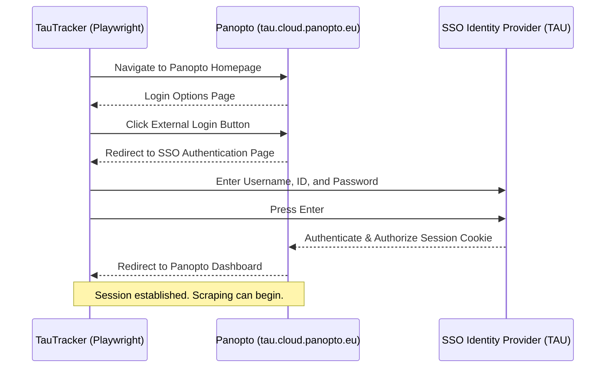
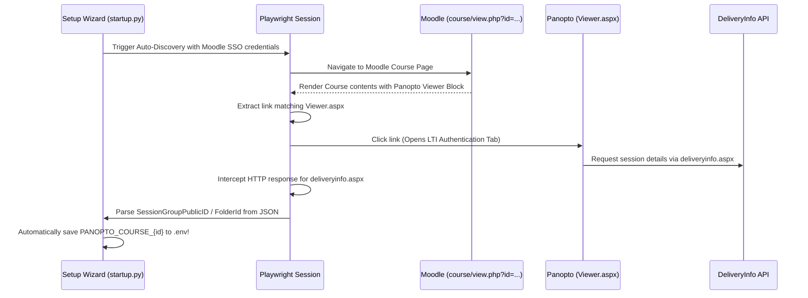
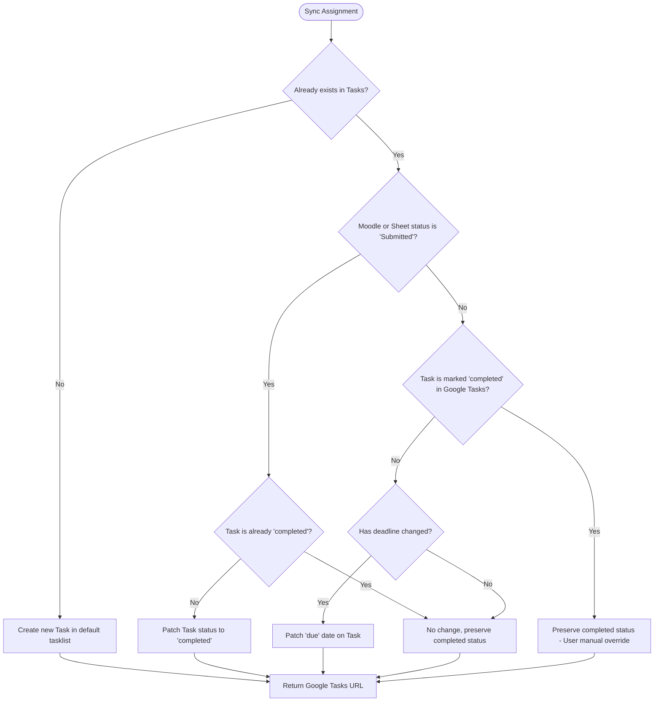

# TauTracker Developer API Guide

This developer guide details the integrations, endpoints, and scraper flows used by TauTracker to synchronize university coursework from Moodle and Panopto into Google Sheets and Google Tasks.

---

## 0. Environment Variables Reference

All runtime configuration is managed through a `.env` file (see `.env.example` for a template). The following table documents every supported key:

| Variable | Required | Default | Description |
| :--- | :---: | :--- | :--- |
| `MOODLE_URL` | ✅ | `https://moodle.tau.ac.il` | Base URL of the Moodle instance. |
| `MOODLE_TOKEN` | ✅ | — | Moodle Mobile Web Service token (from Preferences → Security Keys). |
| `MOODLE_COURSES` | ✅ | — | Comma-separated list of course ID prefixes to filter synced assignments. |
| `SPREADSHEET_NAME` | ✅ | `University Tracker` | Name of the Google Spreadsheet to sync into. |
| `WORKSHEET_NAME` | ✅ | `Year1-SemesterB` | Fallback worksheet name when semester metadata is unavailable. |
| `GOOGLE_TASKS_LIST` | ❌ | `General` | Name of the Google Tasks list to sync assignments into. Created automatically if it doesn't exist. |
| `UNIVERSITY_USERNAME` | ⚠️ | — | TAU SSO username, used for Moodle browser login and Panopto scraping. Replaces the old `PANOPTO_USER`. |
| `UNIVERSITY_PASSWORD` | ⚠️ | — | TAU SSO password. Stored locally only. Replaces the old `PANOPTO_PASS`. |
| `STUDENT_ID` | ⚠️ | — | Israeli ID or Passport number used by the TAU SSO portal. Replaces the old `PANOPTO_PID`. |
| `PANOPTO_URL` | ⚠️ | `https://tau.cloud.panopto.eu` | Root URL of the Panopto instance. |
| `SCRAPE_PANOPTO` | ❌ | `0` (disabled) | Set to `1` to enable headless Playwright scraping of Panopto lectures. |
| `PANOPTO_COURSE_{ID}` | ❌ | — | Maps a Moodle course ID to its Panopto session folder URL. Auto-populated by the setup wizard. |
| `GOOGLE_TOKEN_JSON` | ❌ | — | Allows providing the full `token.json` contents as a single env var (used in GitHub Actions CI). |

> [!NOTE]
> `UNIVERSITY_USERNAME`, `UNIVERSITY_PASSWORD`, and `STUDENT_ID` replaced the old `PANOPTO_USER`, `PANOPTO_PASS`, and `PANOPTO_PID` keys. The setup wizard auto-migrates existing `.env` files.

---


## 1. Moodle Web Service API

Tau Moodle runs on a standard Moodle platform, exposing the Moodle Mobile Web Services protocol. The tracker communicates with Moodle via standard JSON-REST requests using a mobile token (`wstoken`) that users generate from their Moodle Preferences.

### Base Endpoint
```
https://moodle.tau.ac.il/webservice/rest/server.php
```

### Protocol Parameters
All requests are sent via HTTP GET or POST and must include the following common query parameters:
*   `wstoken`: The user's Moodle mobile token.
*   `moodlewsrestformat`: `json` (specifies JSON response format instead of default XML).
*   `wsfunction`: The specific Moodle web service function name.

---

### Endpoints & Web Service Functions

#### 1. Retrieve Site & User Information
*   **Function**: `core_webservice_get_site_info`
*   **Purpose**: Fetches metadata about the user's Moodle account, primarily used to retrieve the unique `userid` required for other queries.
*   **Sample Response**:
    ```json
    {
      "sitename": "מערכת למידה אקדמית - אוניברסיטת תל אביב",
      "username": "student_user",
      "firstname": "John",
      "lastname": "Doe",
      "fullname": "John Doe",
      "userid": 123456,
      ...
    }
    ```

#### 2. Retrieve Enrolled Courses
*   **Function**: `core_enrol_get_users_courses`
*   **Parameters**:
    *   `userid`: The Moodle user ID retrieved from `core_webservice_get_site_info`.
*   **Purpose**: Retrieves all courses that the user is actively or historically enrolled in.
*   **Academic Metadata Extraction**:
    TAU course shortnames and idnumbers contain structural metadata that TauTracker parses using regular expressions.
    *   **Structure of `idnumber`**: `[8-digit Course Code]-[2-digit Group]-[4-digit Year]-[1-digit Semester]`
        *   Example: `03211100-01-2025-1` -> Course `03211100`, Group `01`, Year `2025`, Semester A (`1`).
    *   **Semester Codes**:
        *   `1`: Semester A
        *   `2`: Semester B
        *   `0`: Yearly / Other

#### 3. Retrieve Assignments
*   **Function**: `mod_assign_get_assignments`
*   **Purpose**: Fetches the details of all assignments across the user's courses, including deadlines, descriptions, opening dates, and configurations.
*   **Payload Schema**:
    *   `courses`: An array of course objects containing an `assignments` list.
    *   `allowsubmissionsfromdate`: Epoch timestamp indicating when submissions open.
    *   `duedate`: Nominal deadline epoch timestamp.
    *   `cutoffdate`: Strict final deadline epoch timestamp.

#### 4. Retrieve Assignment Submission Status
*   **Function**: `mod_assign_get_submission_status`
*   **Parameters**:
    *   `assignid`: The unique assignment ID.
*   **Purpose**: Obtains a specific student's submission status for an assignment (e.g. `submitted` vs `new` or `draft`). Also retrieves personal extensions (`extensionduedate`).
*   **Logic**:
    *   TauTracker computes the **True Deadline** as:
        $$\text{True Deadline} = \max(\text{duedate}, \text{cutoffdate}, \text{extensionduedate})$$
    *   **Status Classification**:
        *   `Submitted`: If Moodle's submission status matches `submitted`.
        *   `Not submitted`: If the student hasn't submitted and the True Deadline has passed.
        *   `Assigned`: If the assignment is open and the deadline has not yet passed.

#### 5. Retrieve Course Blocks
*   **Function**: `core_block_get_course_blocks`
*   **Parameters**:
    *   `courseid`: The unique Moodle course ID integer (e.g. `321110401`).
    *   `returncontents`: `1` (indicates whether block content should be returned).
*   **Purpose**: Retrieves all active blocks for a given course page on Moodle. Used for diagnostic extraction of sidebar contents, links, and specialized modules.

#### 6. Retrieve Course Contents
*   **Function**: `core_course_get_contents`
*   **Parameters**:
    *   `courseid`: The unique Moodle course ID integer (e.g. `321110401`).
*   **Purpose**: Retrieves the entire course structure, including modules, sections, forums, quizzes, assignments, and external files. Used for full diagnostic structure inspection.

---

## 2. Panopto Scraper (Single Sign-On Bypass)

Because Panopto at Tel Aviv University utilizes a Shibboleth Single Sign-On (SSO) portal, direct REST API calls are protected by Multi-Factor and SAML authentication redirects. TauTracker integrates **Playwright headless automation** to complete a secure browser-based login and scrape lecture metadata.

### Automation Flow



### Scrape Algorithm details

For each mapped Panopto course folder URL:
1.  **Navigate & Wait**: Navigates to `https://tau.cloud.panopto.eu/Panopto/Pages/Sessions/List.aspx#view=0&folderID="<FOLDER_UUID>"` and waits for network idle.
2.  **Evaluate JavaScript**: Executes in-page JavaScript to scan the DOM:
    *   Finds all anchor links within `.detail-title` or `.list-title`. These hold the lecture's title and direct video recording playback link.
    *   Extracts the timestamp from adjacent `.date-time-container` elements. If empty, falls back to parsing date regex matches inside the item's innerText or defaults to the current timestamp.
3.  **Deduplication & Recitation Filtering**:
    *   Classifies videos containing `"tirgul"` or `"תרגול"` as **Recitations**; others as **Lectures**.
    *   If multiple records represent the same class session (e.g. `Tirgul 3 - Group A` and `Tirgul 3 - Group B`), the deduplication logic keeps only the most recently published video to prevent cluttering the spreadsheet.

### Automated Folder Link Discovery (SSO Interception)

To remove the friction of manually finding and copy-pasting Panopto Folder UUIDs into `.env`, TauTracker implements an automated discovery sub-system (`resolve_course_panopto_folders`):



#### Network Response Interception
The automation attaches a listener to the `response` event inside the newly opened Panopto tab:
```python
def handle_response(response):
    if "deliveryinfo.aspx" in response.url.lower():
        delivery_info_content = response.text()
```
The intercepted response returns a JSON structure containing:
*   `Delivery.SessionGroupPublicID`: The folder UUID.
*   `Delivery.FolderId`: Fallback folder UUID.

This folder UUID is used to construct the direct session list URL required for the scraper:
`https://tau.cloud.panopto.eu/Panopto/Pages/Sessions/List.aspx#folderID="{FolderId}"`

---

## 3. Google Workspace integration

TauTracker synchronizes parsed course items into Google Sheets and Google Tasks. This is configured through a standard desktop application OAuth Client ID.

### OAuth Scopes
*   `https://www.googleapis.com/auth/spreadsheets`: To read, write, format, and append rows inside Google Sheets.
*   `https://www.googleapis.com/auth/drive`: Required to search for the spreadsheet and create sheets dynamically.
*   `https://www.googleapis.com/auth/tasks`: To create, delete, complete, and update personal checklists.

---

### Google Sheets API (via `gspread`)

TauTracker segments assignments and lectures into specific worksheets categorized by year and semester (e.g. `2025-SemesterA`).

#### Worksheet Structure & Headers
Each sheet contains the following column mapping:
| Column | Name | Type | Description |
| :--- | :--- | :--- | :--- |
| **A** | Course | String | Extracted English/ID name of the course. |
| **B** | Type | String | `Assignment`, `Lecture`, or `Recitation`. |
| **C** | Title | String | Assignment name or Lecture Title. |
| **D** | Date | DateTime | Deadline (for Assignments) or Airing Date (for Lectures). |
| **E** | Link | String | Direct link to Moodle assignment page or Panopto video stream. |
| **F** | Status | String | `Submitted`, `Not submitted`, `Assigned`, or `Unattended`. |
| **G** | Tasks Link | String | URL to Google Tasks for quick status checking. |

#### In-Place Synchronization Rules
*   **New Items**: Appended to the top of the worksheet (Row 2, preserving the header at Row 1).
*   **Status Changes**: If Moodle indicates an assignment is `Submitted`, Column F is updated to `Submitted`.
*   **Deadline Drift**: If a professor extends an assignment deadline on Moodle, Column D is automatically updated, and the new date format is normalized.
*   **Last Sync Indicator**: Cells `I1` are updated with `Last Sync: MM/DD/YYYY HH:MM:SS` to trace the background daemon execution.
*   **Sorting**: After writes, the rows are sorted dynamically by **Course** $\rightarrow$ **Resource Type** $\rightarrow$ **Date Descending**.

---

### Google Tasks API

To prevent excessive API rates, all Google Tasks are fetched in bulk once per synchronization cycle and stored in a local execution cache.

#### Task Logic Flow Chart



*   **Google Tasks URL**: The Google Tasks API does not expose direct URLs for individual tasks. TauTracker resolves this by injecting a general tasks dashboard URL:
    `https://calendar.google.com/calendar/u/0/r/tasks`

---

## 4. Code Architecture & Unified Packages

To keep the codebase modular, reusable, and structured, the standalone clients have been organized into a unified package structure:

```
TauTracker/
│
├── clients/                # Unified API Clients Package
│   ├── __init__.py         # Package entry point (exposes client functions)
│   ├── google_client.py    # Google Sheets & Google Tasks integration
│   ├── moodle_client.py    # Moodle API interface & metadata parser
│   └── panopto_client.py   # Playwright headless browser session scraper
│
├── configure_courses.py    # CLI Course Selection tool (imports from 'clients')
├── startup.py              # Guided CLI Setup Wizard (imports from 'clients')
└── main.py                 # Core background sync Orchestrator (imports from 'clients')
```

### Exposing Public API Functions
The `clients/__init__.py` file aggregates and exposes the public interface. This allows any main execution scripts or external integrations to import multiple capabilities in a clean, unified statement:

```python
from clients import (
    get_enrolled_courses,
    get_pending_assignments,
    parse_course_metadata,
    get_new_lectures,
    get_google_services,
    sync_data
)
```

This structural clean-up isolates external API dependencies and ensures easier maintenance and testing of the core business logic.
