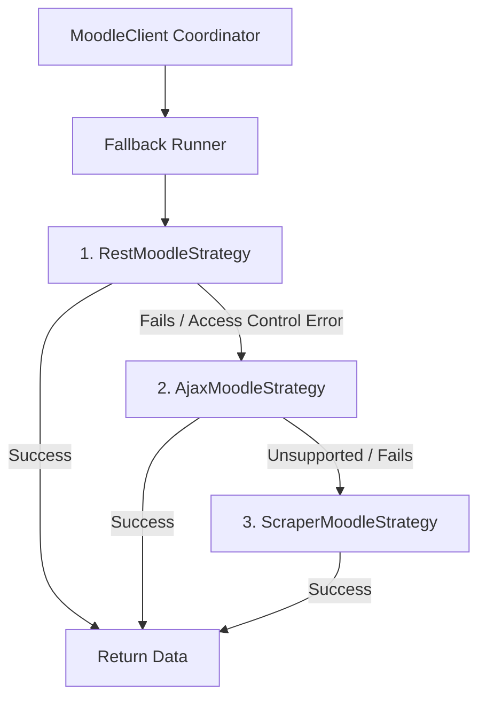

# Noodle — Architecture & Design Specifications

This document defines the system design, data isolation model, platform mechanics, and architectural rationale for the decentralized Noodle application.

---

## 1. System Architecture Overview

Noodle is built as a **fully decentralized, client-only application**. It does not routing requests through a centralized backend server, nor does it store user credentials in a shared cloud database. Instead, every user device (phone or browser) is its own independent API client.

```mermaid
graph TD
    subgraph User Device / Browser
        subgraph apps/extension (Chrome Extension)
            Pop[React Popup UI]
            Opt[React Options Page]
            SW[Service Worker - MV3]
            Loc[chrome.storage.local]
            SyncStore[chrome.storage.sync]
        end

        subgraph apps/mobile (Expo App)
            RN[React Native UI]
            SQL[(SQLite Database)]
            Sec[SecureStore]
            Fetch[Background Fetch Task]
        end

        subgraph packages/moodle-client (Shared Package)
            Engine[Sync Engine]
            Client[Moodle API Client]
            Parser[TAU Metadata Parser]
            GTasks[Google Tasks Sync]
        end
    end

    subgraph External Systems
        Moodle[moodle.tau.ac.il]
        Google[Google Tasks API]
    end

    %% Dependencies
    Pop --> SW
    Opt --> SW
    SW --> Engine
    Loc <--> SW
    SyncStore <--> SW

    RN --> Engine
    Fetch --> Engine
    SQL <--> RN
    SQL <--> Fetch
    Sec <--> RN
    Sec <--> Fetch

    Engine --> Client
    Engine --> Parser
    Engine --> GTasks

    Client -->|Direct HTTPS - CORS Bypass| Moodle
    GTasks -->|OAuth 2.0 REST| Google
```

---

## 2. Directory Layout & Monorepo Structure

The project utilizes a **pnpm workspaces monorepo** to share TypeScript code between the browser extension and the mobile application.

```
Noodle/
├── apps/
│   ├── mobile/                     # React Native + Expo mobile application
│   │   ├── app/                    # Expo Router file-based routing
│   │   ├── components/             # Native mobile UI components
│   │   └── services/               # SQLite wrappers, local push alerts
│   │
│   └── extension/                  # Vite + React Chrome extension (Manifest V3)
│       ├── src/
│       │   ├── background/         # Service worker execution scripts
│       │   ├── popup/              # Compact quick-access popup SPA
│       │   └── options/            # Full options dashboard page SPA
│       └── public/                 # Manifest configuration and icons
│
├── packages/
│   └── moodle-client/              # Shared pure TypeScript API integration layer
│       ├── src/
│       │   ├── moodleApi.ts        # fetch()-based Moodle Web Service functions
│       │   ├── syncEngine.ts       # Orchestrates sync stages and file extraction
│       │   └── courseParser.ts     # Regular expressions for TAU shortnames
│
└── legacy/                         # Archived Python FastAPI codebase (Reference only)
```

---

## 3. Core Architectural Components

### A. Shared Package (`packages/moodle-client`)
*   **Role:** Exposes data types, course parser regexes, API wrappers, and the core sync engine.
*   **Design Constraint:** Strictly environment-agnostic. It cannot import Node.js core libraries (e.g. `fs`, `crypto`) or browser-specific objects (like `window`). It relies entirely on standard JavaScript/TypeScript and the global `fetch()` web API. This ensures compiling and execution compatibility in both React Native (hermes/jsc engine) and Chrome Service Workers.

### B. Chrome Extension (`apps/extension`)
*   **Bundler:** Vite paired with the CRXJS plugin, which parses `manifest.json` to automatically compile background service worker files, assets, and popup HTML pages.
*   **CORS Bypass:** Bypasses Moodle's lack of CORS headers by declaring `*://moodle.tau.ac.il/*` in the manifest's `host_permissions` block. This elevates network requests originating from the **Service Worker** background context.
*   **Ephemeral Service Worker Lifecycle:** Chrome MV3 Service Workers are designed to shut down after 30 seconds of inactivity. To prevent data corruption:
    1.  No in-memory state is maintained globally.
    2.  State is fully restored from `chrome.storage.local` at the beginning of any event handler (alarm or message).
    3.  A synchronization run checkpoints course progress incrementally. If the Service Worker is terminated mid-sync, the next alarm resumes from the last successfully synced course.

### C. Mobile App (`apps/mobile`)
*   **Framework:** Expo SDK 56 + React Native.
*   **CORS Bypass:** React Native runs JavaScript in a native mobile application thread. HTTP requests made via the global `fetch()` bypass standard browser CORS checks because native network requests do not enforce Same-Origin Policies.
*   **Secure Storage:** Sensitive credentials (the Moodle `wstoken` and Google OAuth tokens) are written to `expo-secure-store`, mapping to hardware-level OS keychains.
*   **SQLite Database:** Non-sensitive data (assignments, course codes, colors, files, and zoom links) is cached in a local SQLite file using `expo-sqlite`, ensuring instantaneous UI load times and full offline usability.

---

## 4. Platform Synchronization Mechanisms

### Browser Extension Periodic Sync
*   **Mechanism:** `chrome.alarms` API.
*   **Interval:** 60 minutes.
*   **Lifecycle:** The alarm wakes the Service Worker, which retrieves the Moodle token from `chrome.storage.local`, performs the full sync via the shared library, saves the output, and issues a native Chrome notification for any new deadlines.

### Mobile App Periodic Sync
*   **Mechanism:** `expo-background-fetch` + `expo-task-manager`.
*   **Interval:** OS-controlled.
*   **iOS Execution Behavior:** iOS limits background execution frequency depending on battery level, user behavior, and network conditions. Background tasks can run every 30-120 minutes and are capped at 30 seconds of execution. The sync engine is optimized to parallelize course requests to ensure completion within this tight window.
*   **Android Execution Behavior:** Android delegates background executions to a native `WorkManager` scheduler, offering highly consistent cron-like execution intervals.

---

## 5. Rationale & Trade-offs

| Design Decision | Advantages | Trade-offs / Challenges |
| :--- | :--- | :--- |
| **Monorepo (pnpm workspaces)** | Single repository, 100% logic reuse for Moodle Web Service calls, easy type synchronization. | Incremental build setups, config overhead for TypeScript compile paths. |
| **No Central Proxy Server** | Infinite scaling, zero hosting costs, absolute security compliance, immune to centralized IP blocking. | Client apps must perform OAuth logic themselves; no server to schedule reliable push notifications. |
| **Local SQLite on Mobile** | Blazing-fast UI rendering, complete offline read capability, simple data structures. | Requires database schema migration support when structural attributes change. |
| **MV3 Service Worker Sync** | Runs silently in the background of the browser, low power drain. | Service workers are terminated frequently, necessitating strict state serialization. |
| **Three-Tier Strategy Fallback** | Maximum resilience against university server/plugin changes; zero code changes needed when mobile app returns. | Maintaining multiple parsing/interaction adapters for REST, AJAX, and HTML. |

---

## 6. Moodle Client Modular Fallback Architecture

To handle university infrastructure changes (such as disabling the official Moodle Mobile web service or `tool_mobile` plugin), `packages/moodle-client` implements a Strategy Pattern with Chain-of-Responsibility fallback:



### Strategy Tiers:
1. **Tier 1 — REST Strategy (`RestMoodleStrategy`)**:
   Uses the official Moodle Mobile App web service (`/webservice/rest/server.php`) with the user's `wstoken`. This is the preferred, fastest, and most structured API. If this service is active, it runs with zero overhead.
   * **1-Hour Circuit Breaker**: If Moodle responds with an access control exception (`accessexception`, `servicenotavailable`, or `חריגת בקרת גישה`), `RestMoodleStrategy` trips a 1-hour circuit breaker cooldown (`markUnavailable(3600000)`). During this window, all calls skip REST immediately without firing HTTP requests or polluting logs.
2. **Tier 2 — AJAX Strategy (`AjaxMoodleStrategy`)**:
   Uses Moodle's internal AJAX endpoint (`/lib/ajax/service.php`) with the user's web `sesskey` and browser session cookie. Supports modern Moodle 4.x dashboard endpoints (e.g. `core_course_get_enrolled_courses_by_timeline_classification`).
   * **Static Operation Filtering**: Operations not exposed by Moodle core over AJAX (`getSiteInfo`, `getAssignments`, `getCourseContents`, `getGradeItems`, etc.) are declared statically via `isOperationSupported(op)`, allowing `fallbackRunner` to skip directly to Tier 3 without attempting doomed calls.
   * **Multi-Year Archive Querying**: Queries root and candidate past academic years (e.g. `/2025/lib/ajax/service.php`, `/2024/...`) with `sesskey`.
3. **Tier 3 — Scraper Strategy (`ScraperMoodleStrategy`)**:
   Acts like a standard browser, fetching rendered Moodle pages (`/grade/report/overview/index.php`, `/my/courses.php`, `/user/profile.php`, `/my/`, `/course/view.php?id=...`) with `credentials: 'include'`. Uses pure TypeScript string and regex parsing (fully compliant with Chrome MV3 Service Workers and React Native Hermes) to extract courses, assignment tables, modules, and files.

### Multi-Year Academic Archive Discovery:
Tel Aviv University maintains separate Moodle instances for each academic year (`https://moodle.tau.ac.il/` or `/2026/` for current/upcoming year, `/2025/` for the previous year, `/2024/`, etc.). During academic transitions (such as August–October before new semester enrollments open), the root instance often contains 0 enrolled courses while all active student coursework is located in past academic archives.
* **Dynamic Archive Discovery (`discoverArchiveYears`)**: `ScraperMoodleStrategy` parses root pages (`/`, `/my/`, `/grade/report/overview/index.php`) to dynamically discover year paths (`/(20\d{2})\b`) and archive dropdown selectors.
* **Candidate Year Probing**: Queries root and candidate past years (e.g. `2025`, `2024`) via `Promise.allSettled`, aggregating enrolled courses across all years.
* **Contextual Year Routing**: Tracks `courseYearMap` and `assignYearMap` so subsequent operations (`getCourseContents`, `getGradeItems`, `getSubmissionStatus`) and assignment deep links (`https://moodle.tau.ac.il/${year}/...`) automatically route to the correct academic year instance.

### Automatic Token Renewal on Expiry (D2 Fix):
To prevent silent degradation or unnecessary re-login prompts when the user's `wstoken` expires:
* **Detection**: `fallbackRunner.ts` intercepts `invalidtoken` and `accessexception` errors emitted by `RestMoodleStrategy`.
* **Silent Token Generation**: It calls `s.getMobileToken()` across strategies. `ScraperMoodleStrategy` utilizes the browser's active SSO cookies to send an authenticated POST to `/user/managetoken.php` with `action=resetwstoken`, parsing the freshly issued `wstoken` from `copytoclipboardtoken`.
* **State Synchronization & Instant Retry**: The newly acquired token is distributed to all strategies via `setToken()`, the REST circuit breaker cooldown is cleared, and the operation is retried via REST. The entire flow completes transparently in milliseconds.

### Direct Course-Page Assignment Discovery (D4 Fix):
To prevent missing past or unlisted assignments caused by calendar filtering:
* **Course Page Traversal**: `ScraperMoodleStrategy.getAssignments()` iterates over each course registered in `courseYearMap`.
* **DOM Scraping**: For each course URL (`${yearPrefix}/course/view.php?id=${courseId}`), it extracts anchor tags pointing to `/mod/assign/view.php?id=(\d+)` and parses the `.instancename` elements.
* **Full Data Integrity**: Guarantees that all active, submitted, past, or ungraded assignments visible to the student in course sections are discovered without being constrained by calendar upcoming event date windows.

### Observability in DevMode:
When `devMode: true` is enabled, the coordinator logs every strategy attempt, unsupported function skip, failure reason, and successful fallback transition to the developer console for transparent debugging.
