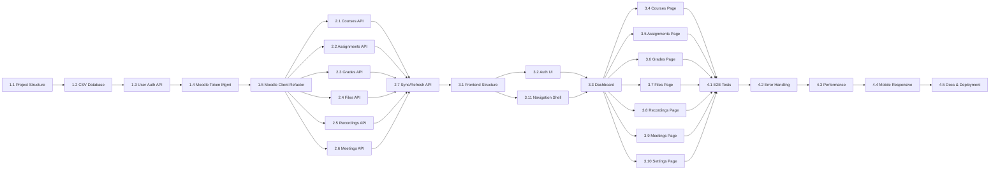

# TauTracker → Full Moodle Replacement UI

> Transform TauTracker from a single-user Google Sheets sync daemon into a multi-user web application with a full Moodle-replacement UI, REST API backend, and local CSV-based database — designed API-first for future Android/iOS apps.

Choose the next task that no one is working on, Don't stop until all tasks are completed.
Commit each task that you completed, and tag each stage.

## Task Status Legend

| Symbol | Meaning |
|--------|---------|
| `[ ]`  | Not started |
| `[/]`  | In progress |
| `[x]`  | Completed |

---

## Current System Summary

**What exists today** ([main.py](file:///d:/ProgramFiles/Projects/TauTracker/main.py), [moodle_client.py](file:///d:/ProgramFiles/Projects/TauTracker/clients/moodle_client.py), [google_client.py](file:///d:/ProgramFiles/Projects/TauTracker/clients/google_client.py), [panopto_client.py](file:///d:/ProgramFiles/Projects/TauTracker/clients/panopto_client.py)):

- **Single-user** Python daemon that runs on GitHub Actions every 12 hours
- Fetches assignments via `mod_assign_get_assignments` + `mod_assign_get_submission_status`
- Fetches grades via `gradereport_user_get_grade_items`
- Scrapes Panopto recordings via Playwright headless browser
- Syncs everything to **Google Sheets** (worksheets per semester) and **Google Tasks**
- Course selection via CLI tool ([configure_courses.py](file:///d:/ProgramFiles/Projects/TauTracker/configure_courses.py))
- Configuration via `.env` file with Moodle token, SSO credentials, Google OAuth

**What does NOT exist yet:**
- No web UI at all
- No multi-user support
- No local database (data lives only in Google Sheets)
- No file download/upload capabilities
- No course content browsing
- No Zoom/meeting integration
- No REST API

---

## Architecture Blueprint

```
┌─────────────────────────────────────────────────────────────┐
│                      FRONTEND (Web UI)                      │
│   HTML/CSS/JS  •  Dashboard  •  Course Pages  •  Settings   │
│           (Future: Android/iOS apps consume same API)        │
└──────────────────────────┬──────────────────────────────────┘
                           │ HTTP REST (JSON)
┌──────────────────────────▼──────────────────────────────────┐
│                   BACKEND (FastAPI)                          │
│   /api/auth/*  •  /api/courses/*  •  /api/assignments/*     │
│   /api/grades/*  •  /api/files/*  •  /api/recordings/*      │
│   /api/meetings/*  •  /api/users/*  •  /api/sync/*          │
└────┬──────────────┬───────────────┬─────────────────────────┘
     │              │               │
┌────▼────┐   ┌─────▼─────┐   ┌────▼────────┐
│ CSV DB  │   │ Moodle API│   │ Panopto     │
│ (local) │   │ (REST)    │   │ (Playwright)│
└─────────┘   └───────────┘   └─────────────┘
```

### Key Design Decisions

1. **Database**: CSV files (as requested), one CSV per entity type (users, courses, assignments, grades, recordings, files, meetings). A `db/` directory with a Python abstraction layer that can later be swapped to SQLite/PostgreSQL.
2. **Backend**: FastAPI (Python) — async, automatic OpenAPI docs, easy for mobile apps to consume.
3. **Frontend**: Vanilla HTML/CSS/JS served by the same FastAPI process — no framework needed initially.
4. **Auth**: JWT tokens issued by the backend; each user stores their own Moodle token encrypted.
5. **Sync model**: On-demand "Refresh" button per user triggers a background sync job that fetches from Moodle → updates CSV → returns fresh data to the UI.

---

## Stage 1: Backend Foundation & User Management

> **Goal**: Stand up the FastAPI server, CSV database layer, user registration/login, and JWT auth. No UI yet — just a working API that can be tested with curl/Postman.

---

### Task 1.1: Project Structure & Dependencies

- `[ ]` **Create the backend project structure**

  **Context**: The existing project is a flat Python script layout. We need to introduce a proper backend application structure alongside the existing code without breaking it.

  **Actions**:
  - Create directory `server/` at the project root to house all backend code
  - Create `server/__init__.py`
  - Create `server/app.py` — FastAPI application factory
  - Create `server/config.py` — backend-specific config (port, JWT secret, CSV paths)
  - Create `server/requirements.txt` with: `fastapi`, `uvicorn[standard]`, `python-jose[cryptography]`, `passlib[bcrypt]`, `python-multipart`, `aiofiles`
  - Create `server/run.py` — entry point: `uvicorn.run("server.app:app", host="0.0.0.0", port=8000, reload=True)`
  - Ensure the existing `main.py`, `clients/`, `config.py` remain untouched and functional

  **Definition of Done**:
  - Running `python server/run.py` starts a FastAPI server on port 8000
  - `GET /` returns `{"status": "ok", "version": "2.0.0"}`
  - `GET /docs` shows the auto-generated Swagger UI
  - Existing `python main.py` still works independently
  - All new dependencies are in `server/requirements.txt`

---

### Task 1.2: CSV Database Abstraction Layer

- `[ ]` **Build a generic CSV-backed data layer with CRUD operations**

  **Context**: We need a lightweight persistence layer that stores data in CSV files but exposes a clean Python API that can later be swapped to SQLite or PostgreSQL. Each entity type gets its own CSV file in a `db/` directory. The abstraction must handle concurrent read/write safely (file locking) since multiple users may trigger syncs simultaneously.

  **Actions**:
  - Create `server/db/` directory
  - Create `server/db/__init__.py`
  - Create `server/db/csv_store.py` — generic `CSVStore` class:
    ```python
    class CSVStore:
        def __init__(self, csv_path: str, columns: list[str], key_column: str)
        def read_all() -> list[dict]
        def read_by_key(key_value: str) -> dict | None
        def query(filters: dict) -> list[dict]
        def insert(record: dict) -> dict
        def update(key_value: str, updates: dict) -> dict | None
        def delete(key_value: str) -> bool
        def upsert(key_value: str, record: dict) -> dict
    ```
  - Use `threading.Lock` per store instance for thread safety
  - Use Python's `csv` module with `DictReader`/`DictWriter`
  - Auto-create the CSV file with headers if it doesn't exist
  - Create `server/db/stores.py` — instantiate all entity stores:
    - `users_store` — columns: `user_id, username, email, password_hash, moodle_token_encrypted, created_at, last_login, settings_json`
    - `user_courses_store` — columns: `user_id, course_id, course_name, semester, year, is_active, added_at`
    - `assignments_store` — columns: `id, user_id, course_id, course_name, assignment_name, moodle_assign_id, cmid, deadline, opened, status, link, grade, grade_max, last_synced`
    - `recordings_store` — columns: `id, user_id, course_id, course_name, title, recording_link, published_date, type, status, last_synced`
    - `files_store` — columns: `id, user_id, course_id, course_name, section_name, file_name, file_url, file_size, mime_type, last_synced`
    - `meetings_store` — columns: `id, user_id, course_id, course_name, title, meeting_url, start_time, end_time, type, last_synced`
    - `sync_log_store` — columns: `id, user_id, sync_type, started_at, finished_at, status, items_synced, error_message`

  **Definition of Done**:
  - Unit tests in `tests/test_csv_store.py` verify all CRUD operations
  - Tests verify thread-safety (concurrent inserts don't corrupt data)
  - Tests verify auto-creation of CSV files with headers
  - Tests verify query filtering works correctly
  - Running the tests creates temporary CSV files in a `tests/tmp/` dir and cleans up after
  - All stores are importable from `server.db.stores`

---

### Task 1.3: User Registration & Authentication API

- `[ ]` **Implement user signup, login, and JWT-based auth**

  **Context**: Each user will have their own Moodle token and data. We need secure registration (password hashing with bcrypt), login (returns JWT), and a middleware/dependency that protects all other endpoints. The JWT payload should contain `user_id` and `username`.

  **Actions**:
  - Create `server/auth/` directory
  - Create `server/auth/__init__.py`
  - Create `server/auth/security.py`:
    - `hash_password(password: str) -> str` (bcrypt)
    - `verify_password(password: str, hash: str) -> bool`
    - `create_access_token(data: dict, expires_delta: timedelta) -> str` (python-jose)
    - `decode_access_token(token: str) -> dict`
  - Create `server/auth/dependencies.py`:
    - `get_current_user(token: str = Depends(oauth2_scheme)) -> dict` — FastAPI dependency that extracts and validates JWT from `Authorization: Bearer <token>` header, returns user dict
  - Create `server/routes/auth.py`:
    - `POST /api/auth/register` — body: `{username, email, password}` → creates user in CSV, returns user_id
    - `POST /api/auth/login` — body: `{username, password}` → validates credentials, returns `{access_token, token_type: "bearer"}`
    - `GET /api/auth/me` — protected; returns current user profile
    - `PUT /api/auth/me` — protected; update profile (email, password)
  - Register routes in `server/app.py`

  **Definition of Done**:
  - `POST /api/auth/register` with valid data returns 201 and creates a row in `db/users.csv`
  - `POST /api/auth/register` with duplicate username returns 409
  - `POST /api/auth/login` with valid credentials returns a JWT token
  - `POST /api/auth/login` with invalid credentials returns 401
  - `GET /api/auth/me` with valid JWT returns user profile (no password hash)
  - `GET /api/auth/me` without JWT returns 401
  - Passwords are stored as bcrypt hashes, never plaintext
  - Unit tests in `tests/test_auth.py` cover all above cases using FastAPI's `TestClient`

---

### Task 1.4: Moodle Token Management API

- `[ ]` **Allow users to securely store and validate their Moodle token**

  **Context**: Each user needs to provide their Moodle Web Service token so the backend can call TAU Moodle on their behalf. The token should be encrypted at rest in the CSV (using Fernet symmetric encryption with a server-side key). We also need a validation endpoint that calls `core_webservice_get_site_info` to verify the token works before saving it.

  **Actions**:
  - Create `server/auth/encryption.py`:
    - `encrypt_token(plaintext: str) -> str` (Fernet, key from `SERVER_SECRET` env var)
    - `decrypt_token(ciphertext: str) -> str`
  - Create `server/routes/settings.py`:
    - `POST /api/settings/moodle-token` — body: `{moodle_token}` → validates by calling `core_webservice_get_site_info`, if valid encrypts and saves to user row, returns `{valid: true, moodle_username, moodle_userid}`
    - `GET /api/settings/moodle-token/status` — returns whether the user has a token configured and whether it's valid (re-validates live)
    - `DELETE /api/settings/moodle-token` — removes the stored token
  - Reuse the existing `clients/moodle_client.py` Moodle API calling pattern but refactor to accept a token parameter instead of reading from global `config.py`

  **Definition of Done**:
  - User can POST a valid Moodle token → it's saved encrypted in the CSV
  - User can POST an invalid token → gets a 400 error with "Invalid Moodle token" message
  - Token is never returned in plaintext to the client (only status: configured/not)
  - `GET /api/settings/moodle-token/status` returns `{configured: true/false, valid: true/false}`
  - Unit tests verify encryption roundtrip and API responses
  - The existing `moodle_client.py` functions are refactored to accept `moodle_url` and `moodle_token` as parameters (backward-compatible: defaults to env vars if not provided)

---

### Task 1.5: Moodle Client Refactoring for Multi-User

- `[ ]` **Refactor the existing Moodle client to be stateless and per-user**

  **Context**: The current [moodle_client.py](file:///d:/ProgramFiles/Projects/TauTracker/clients/moodle_client.py) reads `MOODLE_TOKEN` and `MOODLE_URL` from global config. For multi-user support, every function needs to accept these as parameters. The existing `main.py` flow should still work using the env var defaults.

  **Actions**:
  - Modify every function in `clients/moodle_client.py` to accept `moodle_url=None, moodle_token=None` keyword arguments that default to the global config values
  - Functions affected:
    - `get_enrolled_courses(moodle_url=None, moodle_token=None)`
    - `get_pending_assignments(moodle_url=None, moodle_token=None)`
    - `get_assignment_grades(enrolled_courses, moodle_url=None, moodle_token=None)`
  - Create a new wrapper `server/services/moodle_service.py` that:
    - Accepts a `user_id`, looks up their decrypted Moodle token from the CSV
    - Calls the refactored `clients/` functions with that user's token
    - Returns structured data suitable for the API responses
  - Add new Moodle API functions to `clients/moodle_client.py`:
    - `get_course_contents(course_id, moodle_url=None, moodle_token=None)` — calls `core_course_get_contents`, returns sections with modules (files, URLs, forums, assignments)
    - `get_course_files(course_id, moodle_url=None, moodle_token=None)` — extracts downloadable files from course contents
    - `download_file(file_url, moodle_token)` — downloads a file from `pluginfile.php` using `?token=<token>`
    - `upload_submission(assign_id, file_path, user_id, moodle_url=None, moodle_token=None)` — two-step: upload to draft area via `core_files_upload`, then submit via `mod_assign_save_submission`
    - `submit_assignment(assign_id, moodle_url=None, moodle_token=None)` — calls `mod_assign_submit_for_grading`

  **Definition of Done**:
  - All existing functions accept optional `moodle_url`/`moodle_token` params
  - When params are `None`, they fall back to `config.MOODLE_URL` / `config.MOODLE_TOKEN` (backward compat)
  - `python main.py` still works identically as before
  - New functions `get_course_contents`, `get_course_files`, `download_file`, `upload_submission`, `submit_assignment` are implemented and callable
  - Unit tests in `tests/test_moodle_client.py` test the new functions with mocked HTTP responses (using `unittest.mock.patch` on `requests.get`)
  - `server/services/moodle_service.py` can look up a user's token, decrypt it, and call Moodle functions

---

## Stage 2: Core Data APIs

> **Goal**: Expose all Moodle data through REST API endpoints. Users can fetch their courses, assignments, grades, files, and recordings. Sync/refresh functionality works per-user.

---

### Task 2.1: Courses API

- `[ ]` **Implement course enrollment fetching and user course configuration**

  **Context**: Users need to see all courses they're enrolled in on Moodle, select which ones they want to track, and have this saved to the database. This mirrors the existing [configure_courses.py](file:///d:/ProgramFiles/Projects/TauTracker/configure_courses.py) but as an API.

  **Actions**:
  - Create `server/routes/courses.py`:
    - `GET /api/courses/available` — protected; calls Moodle `core_enrol_get_users_courses` with the user's token, parses semester metadata using existing `parse_course_metadata()`, returns list grouped by semester
    - `GET /api/courses/` — protected; returns user's configured/tracked courses from `user_courses` CSV
    - `POST /api/courses/` — protected; body: `{course_ids: [list]}` → saves selected courses to `user_courses` CSV
    - `DELETE /api/courses/{course_id}` — protected; removes a course from user's tracked list
    - `GET /api/courses/{course_id}` — protected; returns full course details including sections and modules from `core_course_get_contents`
  - Register routes in `server/app.py`

  **Definition of Done**:
  - `GET /api/courses/available` returns all Moodle courses grouped by semester with metadata (year, semester_name, course_id, display_name)
  - `POST /api/courses/` saves selected courses and returns the saved list
  - `GET /api/courses/` returns only the user's tracked courses
  - `GET /api/courses/{course_id}` returns course sections with module details (name, type, URL)
  - All endpoints require valid JWT
  - Tests in `tests/test_courses_api.py` with mocked Moodle responses

---

### Task 2.2: Assignments API

- `[ ]` **Expose assignment listing, details, and submission endpoints**

  **Context**: This is the core Moodle replacement feature. Users need to see all assignments across their tracked courses, view submission status, submit files, and see deadlines. The existing `get_pending_assignments()` logic should be reused.

  **Actions**:
  - Create `server/routes/assignments.py`:
    - `GET /api/assignments/` — protected; returns all assignments for user's tracked courses from the CSV cache. Query params: `?course_id=`, `?status=` (filter by Assigned/Submitted/Not submitted), `?sort=deadline`
    - `GET /api/assignments/{assignment_id}` — protected; returns full assignment details including description, attachments, submission status, feedback
    - `POST /api/assignments/{assignment_id}/submit` — protected; multipart file upload → uploads file to Moodle draft area → calls `mod_assign_save_submission` → calls `mod_assign_submit_for_grading` → updates CSV status to 'Submitted'
    - `GET /api/assignments/upcoming` — protected; returns assignments due within the next 7 days, sorted by deadline

  **Definition of Done**:
  - `GET /api/assignments/` returns paginated assignment list with course name, title, deadline, status, link, grade
  - Filtering by course_id and status works
  - `POST /api/assignments/{id}/submit` successfully uploads a file to Moodle and marks assignment as submitted
  - `GET /api/assignments/upcoming` returns only future-deadline assignments sorted chronologically
  - Tests with mocked Moodle responses cover all endpoints

---

### Task 2.3: Grades API

- `[ ]` **Expose grade viewing per course and per assignment**

  **Context**: Uses the existing `get_assignment_grades()` function that calls `gradereport_user_get_grade_items`. The API should return grades grouped by course with totals.

  **Actions**:
  - Create `server/routes/grades.py`:
    - `GET /api/grades/` — protected; returns all grades across tracked courses. Each entry: `{course_name, assignment_name, grade, grade_max, percentage, is_hidden}`
    - `GET /api/grades/course/{course_id}` — protected; returns grades for a specific course, including course total if available
    - `GET /api/grades/summary` — protected; returns per-course grade summaries (average, completed/total assignments, weighted average if available)

  **Definition of Done**:
  - `GET /api/grades/` returns a flat list of all graded items with calculated percentages
  - `GET /api/grades/course/{course_id}` returns grades filtered to one course
  - `GET /api/grades/summary` returns aggregate statistics per course
  - Hidden grades (gradeishidden=true) are excluded from responses
  - Tests verify grade calculation logic and API responses

---

### Task 2.4: Files API

- `[ ]` **Implement course file browsing and downloading**

  **Context**: Moodle courses contain downloadable files (PDFs, slides, documents) organized by section. We need to use `core_course_get_contents` to list them and `pluginfile.php` to proxy downloads. Files are NOT stored locally — we proxy them from Moodle on-demand.

  **Actions**:
  - Create `server/routes/files.py`:
    - `GET /api/files/course/{course_id}` — protected; returns all downloadable files in a course, grouped by section. Each file: `{file_name, file_url, file_size, mime_type, section_name, time_modified}`
    - `GET /api/files/download` — protected; query param `?url=<moodle_file_url>` → proxies the file download from Moodle's `pluginfile.php` by appending the user's token, streams the response back to the client with proper Content-Type and Content-Disposition headers
    - `GET /api/files/recent` — protected; returns files modified/added in the last 7 days across all tracked courses
  - Create helper in `clients/moodle_client.py`:
    - `get_course_resources(course_id, moodle_url, moodle_token)` — calls `core_course_get_contents`, filters for modules with `contents` array (file resources), returns structured file list

  **Definition of Done**:
  - `GET /api/files/course/{course_id}` returns files grouped by section with metadata
  - `GET /api/files/download?url=...` streams a file from Moodle with correct headers (user's browser downloads the file)
  - File download proxying appends the correct `?token=` parameter
  - `GET /api/files/recent` shows recently modified files
  - Tests verify file listing and download proxy logic

---

### Task 2.5: Recordings API

- `[ ]` **Expose Panopto lecture recording links**

  **Context**: The existing [panopto_client.py](file:///d:/ProgramFiles/Projects/TauTracker/clients/panopto_client.py) scrapes recordings using Playwright. For the multi-user system, we need to cache recording data per-user in the CSV and serve it via API. Scraping should happen during "refresh" operations. SSO credentials are per-user.

  **Actions**:
  - Refactor `clients/panopto_client.py` to accept credentials as parameters:
    - `get_new_lectures(course_mapping, panopto_url=None, username=None, password=None, pid=None, panopto_courses=None)`
  - Create `server/routes/recordings.py`:
    - `GET /api/recordings/` — protected; returns all cached recordings from CSV for the user's tracked courses. Query params: `?course_id=`, `?type=` (Lecture/Recitation)
    - `GET /api/recordings/course/{course_id}` — protected; returns recordings filtered to one course
  - Create `server/routes/settings.py` additions:
    - `POST /api/settings/sso-credentials` — body: `{username, password, student_id}` → encrypts and saves SSO credentials
    - `GET /api/settings/sso-credentials/status` — returns whether SSO creds are configured (not the actual values)
    - `POST /api/settings/panopto-courses` — body: `{course_mappings: [{course_id, panopto_folder_url}]}` → saves Panopto folder mappings

  **Definition of Done**:
  - Panopto client functions accept credential parameters (backward-compatible)
  - `GET /api/recordings/` returns cached recording data from CSV
  - SSO credentials are stored encrypted
  - Recordings display: course name, title, type (Lecture/Recitation), link, published date
  - Tests verify API responses and credential storage

---

### Task 2.6: Meetings (Zoom) API

- `[ ]` **Extract and serve Zoom meeting links from Moodle course content**

  **Context**: TAU Moodle courses often contain Zoom meeting links as URL resources or within course blocks. These are typically `mod_url` modules with URLs containing `zoom.us` or `zoom.` in `core_course_get_contents`. We also need to detect Zoom LTI activities. There is no standard "Zoom API" integration — we extract links from Moodle and present them.

  **Actions**:
  - Add to `clients/moodle_client.py`:
    - `get_course_meetings(course_id, moodle_url, moodle_token)` — calls `core_course_get_contents`, filters for:
      - `modname == "url"` where the URL contains `zoom.us` or `zoom.`
      - `modname == "lti"` (Zoom LTI activities)
      - `modname == "url"` where name contains "zoom", "meeting", "שיעור", "הרצאה"
    - Returns: `{title, meeting_url, section_name, type: "zoom"}`
  - Create `server/routes/meetings.py`:
    - `GET /api/meetings/` — protected; returns all meeting links across tracked courses from cache + live fetch
    - `GET /api/meetings/course/{course_id}` — protected; returns meetings for one course
    - `GET /api/meetings/upcoming` — protected; returns meetings scheduled for today/this week (if time data is available)
  - Cache meeting data in `meetings` CSV store during sync

  **Definition of Done**:
  - Zoom meeting links are extracted from Moodle course contents
  - `GET /api/meetings/` returns meeting links with course name, title, URL, section
  - Both direct URL modules and LTI activities are detected
  - Meetings are cached in CSV and refreshed during sync
  - Tests verify Zoom URL detection logic with sample course content JSON

---

### Task 2.7: Sync/Refresh API

- `[ ]` **Implement the per-user "Refresh" mechanism**

  **Context**: Users need a "Refresh" button that triggers a full data sync from Moodle/Panopto into their CSV data. This should run as a background task (not block the API response) and the client can poll for completion status. The sync should be rate-limited (max once per 5 minutes per user).

  **Actions**:
  - Create `server/services/sync_service.py`:
    - `trigger_sync(user_id: str) -> str` — returns a sync_job_id, launches background thread
    - Background sync flow:
      1. Decrypt user's Moodle token
      2. Call `get_enrolled_courses()` → filter to user's tracked courses
      3. Call `get_pending_assignments()` → upsert into assignments CSV
      4. Call `get_assignment_grades()` → update grade columns in assignments CSV
      5. Call `get_course_resources()` for each course → upsert into files CSV
      6. Call `get_course_meetings()` for each course → upsert into meetings CSV
      7. If SSO creds configured: call `get_new_lectures()` → upsert into recordings CSV
      8. Log sync completion in `sync_log` CSV
    - `get_sync_status(sync_job_id: str) -> dict` — returns progress/completion
  - Create `server/routes/sync.py`:
    - `POST /api/sync/refresh` — protected; triggers sync, returns `{sync_id, status: "started"}`
    - `GET /api/sync/status/{sync_id}` — protected; returns sync progress
    - `GET /api/sync/history` — protected; returns last 10 sync logs for the user
  - Implement rate limiting: reject if last sync was < 5 minutes ago

  **Definition of Done**:
  - `POST /api/sync/refresh` starts a background sync and returns immediately with a job ID
  - `GET /api/sync/status/{id}` shows progress: `started`, `syncing_assignments`, `syncing_grades`, `syncing_files`, `syncing_recordings`, `completed`, or `failed`
  - Rate limiting prevents abuse (returns 429 if synced < 5 min ago)
  - All data stores are updated after a successful sync
  - `GET /api/sync/history` shows recent sync runs with timing and item counts
  - Tests verify the sync flow with mocked Moodle responses

---

## Stage 3: Web Frontend — Core UI

> **Goal**: Build the full Moodle-replacement web UI. This is the most user-facing stage — the UI must be polished, modern, and functionally complete.

---

### Task 3.1: Frontend Project Structure & Design System

- `[ ]` **Set up the frontend file structure and CSS design system**

  **Context**: The frontend should be served from `server/static/` by FastAPI. No build step — vanilla HTML/CSS/JS with ES6 modules. The design should be modern, dark-mode, with glassmorphism effects, smooth animations, and a premium academic feel. Use Google Fonts (Inter).

  **Actions**:
  - Create `server/static/` directory structure:
    ```
    server/static/
    ├── index.html          # SPA shell with routing
    ├── css/
    │   ├── reset.css       # CSS reset
    │   ├── variables.css   # Design tokens (colors, spacing, fonts, shadows)
    │   ├── base.css        # Base styles
    │   ├── components.css  # Reusable component styles
    │   └── pages.css       # Page-specific layouts
    ├── js/
    │   ├── app.js          # Main app, router, state management
    │   ├── api.js          # API client (fetch wrapper with JWT)
    │   ├── router.js       # Client-side hash router
    │   ├── auth.js         # Login/register logic
    │   ├── components/     # Reusable UI components
    │   └── pages/          # Page modules
    └── assets/
        └── icons/          # SVG icons
    ```
  - Configure FastAPI to serve static files: `app.mount("/", StaticFiles(directory="server/static", html=True))`
  - Design tokens in `variables.css`:
    - Primary palette: Deep blue/purple (#1a1a2e → #16213e → #0f3460 → #533483)
    - Accent: Bright cyan (#00d2ff) and warm gold (#ffd700)
    - Background: Dark (#0d1117, #161b22, #21262d)
    - Text: White (#f0f6fc) with muted secondary (#8b949e)
    - Glass effect: `backdrop-filter: blur(12px); background: rgba(255,255,255,0.05);`
    - Border radius: 12px for cards, 8px for inputs, 24px for pills
    - Font: Inter (Google Fonts)

  **Definition of Done**:
  - Navigating to `http://localhost:8000` serves the SPA shell
  - The design system CSS is complete with all tokens, a reset, and base styles
  - A `<div id="app">` container is ready for page rendering
  - Google Fonts (Inter) are loaded
  - The page looks polished even with placeholder content (dark background, proper fonts, no unstyled flash)

---

### Task 3.2: Authentication UI (Login & Registration)

- `[ ]` **Build login and registration pages with form validation**

  **Context**: First screens the user sees. Must be visually impressive — centered card with glassmorphism, animated background, smooth transitions between login and register modes.

  **Actions**:
  - Create `server/static/js/pages/auth.js`:
    - Renders login form (username, password, submit button, "Create account" link)
    - Renders register form (username, email, password, confirm password, submit button, "Already have account" link)
    - Animated toggle between login/register (slide or fade transition)
    - Form validation (required fields, email format, password match, min length)
    - On submit: calls `POST /api/auth/login` or `/register`
    - On success: stores JWT in `localStorage`, redirects to dashboard
    - On error: shows error message with shake animation
  - Create `server/static/js/api.js`:
    - `apiClient.post(url, body)` / `apiClient.get(url)` — wraps `fetch()` with:
      - `Authorization: Bearer <token>` header from localStorage
      - JSON content type
      - Auto-redirect to login on 401
      - Error handling and response parsing
  - Create `server/static/js/auth.js`:
    - `isAuthenticated()` — checks if valid JWT exists in localStorage
    - `getToken()` — returns stored JWT
    - `logout()` — clears JWT and redirects to login
    - `getCurrentUser()` — decodes JWT to extract username/user_id

  **Definition of Done**:
  - Login page renders with glassmorphism card, animated background gradient
  - Registration form appears with smooth transition
  - Form validation shows inline error messages (red border + text)
  - Successful login stores JWT and redirects to `#/dashboard`
  - Invalid credentials show error with shake animation
  - Logout clears token and returns to login
  - Works on mobile viewport (responsive)

---

### Task 3.3: Dashboard Page

- `[ ]` **Build the main dashboard — the "home" screen after login**

  **Context**: The dashboard is the Moodle replacement's landing page. It should show at a glance: upcoming assignments, recent grades, quick links to Zoom meetings, and sync status. Think of it as a Moodle dashboard but much more polished.

  **Actions**:
  - Create `server/static/js/pages/dashboard.js`:
    - **Header bar**: User greeting ("Hello, {username}"), current date, Refresh button with spinner animation, notification bell, settings gear icon, logout
    - **Stats row**: 4 stat cards showing: Total Courses tracked, Pending Assignments, Upcoming Deadlines (next 7 days), Ungraded submissions
    - **Upcoming Assignments widget**: Card showing next 5 assignments sorted by deadline, each with course name pill, title, countdown timer ("in 2 days"), status badge (Assigned/Submitted), click → assignment detail
    - **Recent Grades widget**: Card showing last 5 graded items, each with course name, assignment title, grade/max, percentage with colored progress bar (green >80, yellow >60, red <=60)
    - **Quick Links widget**: Active Zoom meetings and recent recordings (last 3), with direct join/play links
    - **Sync status footer**: "Last synced: 5 minutes ago" with refresh button
  - Implement the Refresh button:
    - On click: calls `POST /api/sync/refresh`
    - Shows spinner animation on the button
    - Polls `GET /api/sync/status/{id}` every 2 seconds
    - On completion: reloads all dashboard data, shows success toast notification
    - On failure: shows error toast

  **Definition of Done**:
  - Dashboard renders with all widgets populated from API data
  - Stat cards have animated count-up numbers on load
  - Assignment countdown shows relative time ("in 2 days", "overdue by 3 hours")
  - Grade progress bars are animated
  - Refresh button triggers sync, shows progress, and reloads data on completion
  - Toast notifications appear/disappear with smooth animation
  - Empty states show friendly messages ("No upcoming assignments 🎉")
  - Responsive: collapses to single column on mobile

---

### Task 3.4: Courses Page

- `[ ]` **Build the courses list and individual course detail page**

  **Context**: Users need to browse their tracked courses and configure which courses to follow. The course detail page should show all course content organized by section (like Moodle's course page).

  **Actions**:
  - Create `server/static/js/pages/courses.js`:
    - **Courses list view** (`#/courses`):
      - Grid of course cards with: course name, semester badge, assignment count, file count
      - "Manage Courses" button → opens a modal with all Moodle courses (from `/api/courses/available`), checkboxes to select, grouped by semester, save button
      - Search/filter bar
    - **Course detail view** (`#/courses/{course_id}`):
      - Course header with name, semester, instructor (if available)
      - Tab navigation: **Content** | **Assignments** | **Grades** | **Files** | **Recordings** | **Meetings**
      - **Content tab**: Sections with expandable/collapsible modules (mirrors Moodle course structure from `core_course_get_contents`)
      - **Assignments tab**: Filtered assignment list for this course
      - **Grades tab**: Grade list for this course with total
      - **Files tab**: File browser grouped by section, with download buttons
      - **Recordings tab**: Lecture/recitation videos with play links
      - **Meetings tab**: Zoom meeting links

  **Definition of Done**:
  - Course grid loads from API, shows cards with summary data
  - "Manage Courses" modal fetches available courses, allows selection, saves configuration
  - Course detail page shows tabbed interface with all 6 tabs
  - Content tab renders Moodle course structure with expandable sections
  - All tabs fetch data from respective API endpoints
  - Navigation: clicking a course card → course detail page
  - Back button works via hash router
  - Responsive design

---

### Task 3.5: Assignments Page

- `[ ]` **Build the full assignments view with filtering, details, and submission**

  **Context**: Central feature — all assignments across all courses, with filtering, status badges, deadline indicators, and the ability to submit files directly.

  **Actions**:
  - Create `server/static/js/pages/assignments.js`:
    - **Assignments list view** (`#/assignments`):
      - Filter bar: course dropdown (all courses / specific), status filter (All/Assigned/Submitted/Not submitted/Overdue), sort (deadline/course/status)
      - Assignment cards with: course name pill, title, deadline with countdown, status badge with color (green=Submitted, yellow=Assigned, red=Overdue/Not submitted), grade if available
      - Click → assignment detail panel (slide-in or modal)
    - **Assignment detail panel**:
      - Full assignment description (HTML rendered from Moodle)
      - Deadline with countdown and calendar icon
      - Submission status with timestamp
      - Grade display (if graded) with colored progress bar
      - **File submission area**: drag-and-drop zone or file picker, upload progress bar, submit button
      - Direct link to Moodle assignment page
      - Feedback/comments from instructor (if available from Moodle API)
    - Implement file submission:
      - On file select: preview file name and size
      - On submit: `POST /api/assignments/{id}/submit` with multipart form data
      - Show upload progress bar
      - On success: update status badge to "Submitted", show success toast
      - On error: show error message

  **Definition of Done**:
  - Full assignment list loads with all assignments across tracked courses
  - Filtering by course and status works without page reload
  - Sorting works (deadline, course name, status)
  - Assignment detail panel shows complete info including description
  - File submission works end-to-end: select file → upload → Moodle submission → status update
  - Drag-and-drop file upload zone works
  - Overdue assignments are visually highlighted (red accent)
  - Deadline countdown is live (updates every minute)

---

### Task 3.6: Grades Page

- `[ ]` **Build the grades overview with visualizations**

  **Context**: A grade book view showing all grades, per-course summaries, and visual indicators. Should feel like a polished transcript.

  **Actions**:
  - Create `server/static/js/pages/grades.js`:
    - **Overview** (`#/grades`):
      - Per-course collapsible sections
      - Each course section: course name header, list of graded assignments with grade/max, percentage bar, course average/total at bottom
      - Overall statistics at top: total graded items, overall average percentage, best/worst course
    - **Grade detail**: clicking a grade item shows the assignment name, submission date, grade, feedback
    - Color coding: ≥90 gold, ≥80 green, ≥65 yellow, <65 red
    - Optional: small grade trend chart (if multiple grades per course) using canvas

  **Definition of Done**:
  - Grades page loads with all graded items grouped by course
  - Percentage bars are color-coded and animated on load
  - Course totals are calculated and displayed
  - Overall statistics card shows aggregate data
  - Hidden grades are not shown
  - Empty states handled ("No grades yet")
  - Responsive layout

---

### Task 3.7: Files Page

- `[ ]` **Build the file browser with download functionality**

  **Context**: Users need to browse and download course files (lecture slides, PDFs, documents) without going to Moodle. Files are organized by course and section.

  **Actions**:
  - Create `server/static/js/pages/files.js`:
    - **Files browser** (`#/files`):
      - Course selector/accordion (expand a course to see its sections)
      - Section headers with file count
      - File entries with: icon (based on mime type: PDF, DOC, PPT, etc.), file name, file size, last modified date, download button
      - Download button → calls `/api/files/download?url=...` → triggers browser download
      - "Download All" button per section (downloads as individual files sequentially)
    - **Recent files** tab: files modified in the last 7 days across all courses
    - Search bar to filter files by name

  **Definition of Done**:
  - File browser shows files organized by course → section hierarchy
  - File icons match the file type (PDF icon, Word icon, etc.)
  - Download button triggers actual file download through the proxy API
  - File sizes are human-readable (KB, MB)
  - Recent files tab shows newest files across all courses
  - Search filters files by name in real-time
  - Loading states while fetching file lists

---

### Task 3.8: Recordings Page

- `[ ]` **Build the lecture recordings browser**

  **Context**: Shows Panopto lecture and recitation recordings. Users should be able to browse by course, distinguish between lectures and recitations, and click to watch.

  **Actions**:
  - Create `server/static/js/pages/recordings.js`:
    - **Recordings list** (`#/recordings`):
      - Filter by course (dropdown) and type (All/Lecture/Recitation)
      - Recording cards with: course name pill, title, type badge (Lecture=blue, Recitation=green), published date, play button (opens Panopto link in new tab)
      - Sort by date (newest first)
    - **Course grouping**: collapsible sections per course
    - Status: "Watched" / "Unwatched" (tracked locally in CSV, toggled by user click)

  **Definition of Done**:
  - Recordings page lists all recordings from the CSV cache
  - Filtering by course and type works
  - Play button opens Panopto link in a new tab
  - Type badges visually distinguish Lectures from Recitations
  - Watch status can be toggled and persists
  - Empty state if Panopto is not configured

---

### Task 3.9: Meetings Page

- `[ ]` **Build the Zoom meetings page**

  **Context**: Shows extracted Zoom meeting links from Moodle. Users can quickly join meetings and see which courses have active Zoom links.

  **Actions**:
  - Create `server/static/js/pages/meetings.js`:
    - **Meetings list** (`#/meetings`):
      - Cards per meeting: course name, meeting title, "Join" button (opens Zoom link), section name where it was found
      - Group by course
      - Visual indicator for "today's meetings" vs "permanent links"
    - **Quick join**: prominent "Join" buttons with Zoom icon

  **Definition of Done**:
  - Meetings page shows all extracted Zoom links grouped by course
  - "Join" button opens the Zoom link in a new tab
  - Empty state if no Zoom links found
  - Visually polished with Zoom branding colors on join buttons

---

### Task 3.10: Settings Page

- `[ ]` **Build the user settings and configuration page**

  **Context**: Users need to manage their Moodle token, SSO credentials, Panopto course mappings, notification preferences, and account settings.

  **Actions**:
  - Create `server/static/js/pages/settings.js`:
    - **Account section**: Change email, change password
    - **Moodle Integration section**:
      - Moodle token input with "Validate" button (calls `/api/settings/moodle-token`)
      - Status indicator: ✅ Connected / ❌ Not configured / ⚠️ Invalid token
    - **Panopto Integration section**:
      - SSO credentials form (username, ID, password) with save button
      - Status indicator for SSO: ✅ Configured / ❌ Not configured
      - Panopto course folder mappings (manual override)
    - **Course Management section**:
      - Link to "Manage Courses" (same modal as courses page)
      - Active courses list with remove buttons
    - **Data section**:
      - "Force Refresh All Data" button
      - "Clear Local Cache" button
      - "Export My Data" button (downloads all user CSV data as JSON)
    - **About section**: Version, links to GitHub

  **Definition of Done**:
  - All setting sections render with current values from API
  - Moodle token can be entered and validated (live API check)
  - SSO credentials can be saved (encrypted)
  - Password change works with old password verification
  - "Force Refresh" triggers sync
  - Visual status indicators show connection state
  - All settings persist across sessions

---

### Task 3.11: Navigation & Layout Shell

- `[ ]` **Build the app shell with sidebar navigation and responsive layout**

  **Context**: The SPA needs a consistent layout with sidebar navigation, breadcrumbs, and mobile hamburger menu. The sidebar should highlight the current page.

  **Actions**:
  - Create `server/static/js/components/`:
    - `sidebar.js` — Sidebar with navigation items:
      - 📊 Dashboard
      - 📚 Courses
      - 📝 Assignments
      - 📈 Grades
      - 📁 Files
      - 🎥 Recordings
      - 📹 Meetings
      - ⚙️ Settings
      - 🚪 Logout
    - `header.js` — Top bar with: page title, search bar (global), refresh button, user avatar/name dropdown
    - `toast.js` — Toast notification system (success/error/info)
    - `modal.js` — Reusable modal component
    - `loading.js` — Loading spinner and skeleton loaders
  - Update `app.js` with hash router:
    - Routes: `#/login`, `#/register`, `#/dashboard`, `#/courses`, `#/courses/:id`, `#/assignments`, `#/grades`, `#/files`, `#/recordings`, `#/meetings`, `#/settings`
    - Route guards: unauthenticated → redirect to `#/login`
    - Render layout shell (sidebar + header + content area) for authenticated routes
    - Render auth page standalone for login/register

  **Definition of Done**:
  - Sidebar renders with all navigation items and SVG icons
  - Current page is highlighted in the sidebar
  - Clicking a nav item changes the route and renders the page
  - Mobile: sidebar collapses to hamburger menu
  - Page transitions have fade animation
  - Toast system works (success/error messages)
  - Modal system works (used by "Manage Courses" etc.)
  - Loading spinners appear while data is being fetched
  - All routes work correctly via hash router

---

## Stage 4: Polish, Testing & Deployment

> **Goal**: Production-readiness — comprehensive tests, error handling, performance optimization, and deployment configuration.

---

### Task 4.1: End-to-End API Tests

- `[ ]` **Write comprehensive API integration tests**

  **Context**: Every API endpoint should be tested with realistic data. Use FastAPI's `TestClient` with mocked Moodle responses.

  **Actions**:
  - Create test files:
    - `tests/test_auth_api.py` — registration, login, JWT, profile update
    - `tests/test_courses_api.py` — course listing, selection, details
    - `tests/test_assignments_api.py` — listing, filtering, submission
    - `tests/test_grades_api.py` — grade listing, summaries
    - `tests/test_files_api.py` — file listing, download proxy
    - `tests/test_recordings_api.py` — recording listing
    - `tests/test_meetings_api.py` — meeting listing
    - `tests/test_sync_api.py` — sync trigger, status, rate limiting
  - Each test file should:
    - Create a test user via register endpoint
    - Set up a mock Moodle token
    - Mock `requests.get` for Moodle API calls with realistic response fixtures
    - Test happy path and error cases
  - Create `tests/fixtures/` directory with sample Moodle API response JSON files

  **Definition of Done**:
  - All test files pass with `pytest tests/`
  - Coverage ≥ 80% of backend code
  - Each API endpoint has at least 2 tests (happy path + error case)
  - Tests use realistic Moodle response fixtures
  - Tests are isolated (each test creates and tears down its own data)
  - A `pytest.ini` or `pyproject.toml` configures test discovery

---

### Task 4.2: Error Handling & Edge Cases

- `[ ]` **Implement comprehensive error handling throughout the stack**

  **Context**: Users will encounter network issues, expired tokens, rate limits, and malformed data. The app must handle all of these gracefully.

  **Actions**:
  - Backend:
    - Global exception handler in FastAPI that returns consistent error JSON `{error: string, code: int}`
    - Moodle token expiry detection → return 401 with "Moodle token expired, please re-enter"
    - Network timeout handling for Moodle API calls (5 second timeout)
    - CSV corruption recovery (if CSV is malformed, recreate with headers)
    - Concurrent write protection verification
  - Frontend:
    - Global `fetch` error handler in `api.js`
    - Network offline detection → show "You are offline" banner
    - Retry logic for failed requests (exponential backoff, max 3 retries)
    - Form error states for all inputs
    - Empty states for all data views
    - Loading skeleton components for all pages

  **Definition of Done**:
  - No unhandled exceptions in backend (all return proper HTTP error codes)
  - Frontend shows user-friendly error messages for all failure modes
  - Network offline shows a persistent banner
  - Moodle token expiry prompts re-configuration
  - CSV corruption is auto-recovered
  - All pages have loading and empty states

---

### Task 4.3: Performance Optimization

- `[ ]` **Optimize API response times and frontend rendering**

  **Actions**:
  - Backend:
    - Cache Moodle API responses in memory for 60 seconds (avoid redundant calls during page loads)
    - CSV read caching: cache parsed CSV data in memory, invalidate on write
    - Pagination for large data sets (assignments, files, recordings)
  - Frontend:
    - Lazy load page modules (only load JS for the active page)
    - Virtual scrolling for long lists (>50 items)
    - Debounce search/filter inputs (300ms)
    - Cache API responses in sessionStorage where appropriate

  **Definition of Done**:
  - Dashboard loads in < 500ms after initial data fetch
  - Assignment list with 100+ items scrolls smoothly
  - Search filtering responds within 100ms
  - API calls are not duplicated for the same data within 60 seconds

---

### Task 4.4: Responsive Design & Mobile Experience

- `[ ]` **Ensure the entire UI works on mobile viewports**

  **Context**: While native apps are planned for the future, the web UI should work well on mobile browsers as a stopgap. This also validates the design for the eventual React Native / Flutter app.

  **Actions**:
  - Test and fix all pages at 375px (iPhone SE), 390px (iPhone 14), and 768px (iPad) viewports
  - Sidebar → hamburger menu with slide-in overlay on mobile
  - Cards → single column on mobile
  - Tables → horizontal scroll or card layout on mobile
  - Assignment detail → full screen modal on mobile
  - File upload → tap-friendly zones
  - Touch-friendly button sizes (min 44px tap target)

  **Definition of Done**:
  - All pages render correctly at 375px width
  - No horizontal scrolling on any page
  - All interactive elements are tap-friendly (44px min)
  - Sidebar collapses to hamburger on mobile
  - Modal overlays are properly styled on mobile
  - Navigation is accessible via bottom nav bar on mobile

---

### Task 4.5: Documentation & Deployment

- `[ ]` **Write setup documentation and deployment configuration**

  **Actions**:
  - Update `README.md` with new architecture overview and setup instructions:
    - System requirements (Python 3.10+)
    - Installation steps (pip install requirements, set env vars, run server)
    - Environment variables documentation
    - API documentation link (FastAPI /docs)
  - Create `docs/API_REFERENCE.md` — auto-generated from FastAPI OpenAPI schema
  - Create `docker-compose.yml` for easy deployment:
    - Python backend container
    - Volume mount for `db/` directory (persistent CSV data)
    - Environment variable passthrough
  - Create `docs/ARCHITECTURE.md` — system design document for future developers

  **Definition of Done**:
  - A new user can follow README to set up the system from scratch in < 15 minutes
  - `docker-compose up` starts the full application
  - API docs are accessible at `/docs`
  - Architecture document explains the design for future mobile app developers

---

## Stage 5: Future Considerations (Out of Scope — Documented for Planning)

> These items are **not part of the current implementation** but are documented here to inform design decisions made in Stages 1-4.

### 5.1: Database Migration (CSV → SQLite → PostgreSQL)
- `[ ]` The `CSVStore` abstraction layer is designed so that swapping to SQLite or PostgreSQL only requires implementing a new `Store` class with the same interface. No API or frontend changes needed.

### 5.2: Mobile Apps (Android / iOS)
- `[ ]` The REST API is designed API-first. All data and actions are accessible via HTTP endpoints with JWT auth. A React Native or Flutter app can consume the exact same API with zero backend changes.

### 5.3: Push Notifications
- `[ ]` WebSocket or Server-Sent Events for real-time sync updates. Mobile: Firebase Cloud Messaging (FCM) for push notifications on new assignments or grades.

### 5.4: Google Sheets/Tasks Integration Preservation
- `[ ]` The existing `google_client.py` sync can be optionally retained as a "background export" feature for users who still want their data in Google Sheets.

### 5.5: Multi-Instance Support
- `[ ]` Configuration could support other Moodle instances (not just TAU) by making `MOODLE_URL` per-user instead of global.

### 5.6: Calendar Integration
- `[ ]` A dedicated calendar view showing all deadlines, meetings, and recordings on a monthly/weekly grid. Export to iCal format.

### 5.7: Forum Integration
- `[ ]` Browse and participate in Moodle forums via `mod_forum_get_forums_by_courses` and `mod_forum_get_discussion_posts`.

---

## Dependency Graph



---

## Design Decisions (Resolved)

| # | Question | Decision |
|---|----------|----------|
| Q1 | Moodle URL scope | **TAU-only for now** (`moodle.tau.ac.il` as global config). Document expansion path for multi-institution support in architecture docs. |
| Q2 | Google Sheets backward compatibility | **Fully replaced.** Google Sheets sync (`google_client.py`) will NOT be retained. The new UI is the sole interface. |
| Q3 | File submission size limit | **<10MB**, use `core_files_upload` (base64). Document the limitation and the `/webservice/upload.php` multipart upgrade path. |
| Q4 | Panopto SSO credentials | **Per-user only.** Each user stores their own SSO credentials. **Zero cross-user data access.** Complete user isolation. |
| Q5 | Hosting model | **Server deployment**, wrapped in **Docker** at the end. Backend runs on a shared server serving multiple users. |
