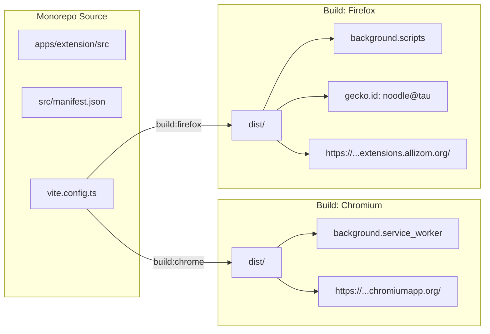

# Noodle — Master System Test Cases Catalog

This document is the authoritative test catalog for **Noodle**. It is designed specifically for **AI Coding Agents** and **QA Developers** to understand, implement, and verify tests across the entire monorepo:
* **Browser Extension** (`apps/extension`): Tested on both **Chromium** (Google Chrome, Brave, Edge) and **Firefox** (Gecko)
* **Mobile App** (`apps/mobile`): Tested on iOS, Android, and Expo Web
* **Shared Client Core** (`packages/moodle-client`): Pure TypeScript shared engine

---

## 1. Agent Testing Guide & Target Platforms

Every test case in this catalog defines its target platform and testing modality:

### A. Testing Modalities

#### 1. Automated Testing (`Automated`)
* **Definition**: Programmatic, headless tests executed via CLI or CI/CD pipelines.
* **Test Runners**:
  * **Unit & Parser Tests**: `jest` in `packages/moodle-client` (`pnpm --filter @tautracker/moodle-client test`).
  * **Extension Tests**: Vitest / Playwright headless with Chromium and Firefox contexts (`playwright.chromium` and `playwright.firefox`).
  * **Mobile Tests**: Jest / React Native Testing Library in `apps/mobile`.
* **Agent Role**: Write test files, mock network responses (`fetch`, `chrome.*`, `browser.*`, `expo-*`), execute test commands, and assert outputs.

#### 2. Gemini Browser Interaction Agent Testing (`Browser Agent`)
* **Definition**: Interactive, manual-style testing performed by an AI Agent equipped with browser interaction tools (Chrome DevTools Protocol, Playwright sessions, or Gemini `/browser` commands).
* **Target Contexts**:
  * **Chromium Extension Dev**: Launched via `pnpm --filter extension run dev` or unpacked from `apps/extension/dist`.
  * **Firefox Extension Dev**: Launched via `pnpm --filter extension run dev:firefox` or loaded as temporary add-on via `about:debugging` from `apps/extension/dist`.
  * **Mobile Web Client**: Launched via `pnpm --filter mobile run web` (available at `http://localhost:8081`).
* **Agent Role**: Launch browser session, interact with UI controls, verify layout responses in Hebrew (RTL) and English (LTR), validate modal dialogs, and inspect local storage/cookies.

---

### B. Platform & Browser Target Key

| Platform Identifier | Meaning & Scope |
| :--- | :--- |
| **`All (Mobile + Chrome + Firefox)`** | Must function identically across the Mobile App and both extension targets (Chromium & Firefox). |
| **`Extension (Chrome & Firefox)`** | Desktop browser extension feature; must pass on both Chromium (MV3 Service Worker) and Firefox (MV3 Scripts). |
| **`Extension (Chromium Specific)`** | Tests Chromium-exclusive behaviors (Chrome MV3 ephemeral service worker 30s idle lifecycle, `chromiumapp.org` OAuth). |
| **`Extension (Firefox Specific)`** | Tests Firefox/Gecko-exclusive behaviors (`background.scripts`, Gecko ID `noodle@tau`, Total Cookie Protection). |
| **`Mobile Only`** | Mobile app feature relying on native React Native / Expo hardware APIs (SQLite, SecureStore, Sharing, etc.). |

---

### C. Extension Architecture Differences: Chromium vs. Firefox

Agents implementing or testing extension features must account for the following engine variations:

1. **Manifest Background Declaration**:
   * **Chromium**: Uses `"background": { "service_worker": "src/background/serviceWorker.ts", "type": "module" }`. Service worker is ephemeral and shuts down after 30 seconds of inactivity.
   * **Firefox**: In `vite.config.ts`, `manifest.background.service_worker` is converted to `manifest.background.scripts = [...]`. Runs as an event page script under Gecko.
2. **Browser Extension Polyfill**:
   * Code uses `import browser from 'webextension-polyfill'` to normalize `chrome.*` and `browser.*` APIs.
3. **Google OAuth Redirect URLs**:
   * **Chromium**: `https://<extension-id>.chromiumapp.org/`.
   * **Firefox**: `browser.identity.getRedirectURL()` resolves to `https://<extension-id>.extensions.allizom.org/`.
4. **Cookie APIs & Partitioning**:
   * Firefox uses **Total Cookie Protection (dFPI)**, which partitions cookies by top-level site. Clearing cookies on logout requires sweeping all partition stores.
5. **Commands for Extension Dev & Build**:
   * **Chromium Dev**: `pnpm --filter extension run dev`
   * **Firefox Dev**: `pnpm --filter extension run dev:firefox`
   * **Chromium Build**: `pnpm --filter extension run build:chrome`
   * **Firefox Build**: `pnpm --filter extension run build:firefox`

---

## 2. Quick Reference Matrix

| ID | Feature / Action | Platform Target | Modality | Category |
| :--- | :--- | :--- | :--- | :--- |
| **TC-AUTH-01** | TAU SSO Login Redirect Chain | All (Mobile + Chrome + Firefox) | Automated & Browser Agent | Auth & Session |
| **TC-AUTH-02** | Israeli ID Mod-10 Validation | All (Mobile + Chrome + Firefox) | Automated & Browser Agent | Auth & Session |
| **TC-AUTH-03** | Invalid Credentials Error Handling | All (Mobile + Chrome + Firefox) | Automated & Browser Agent | Auth & Session |
| **TC-AUTH-04** | "Remember Me" Credential Persistence | All (Mobile + Chrome + Firefox) | Automated & Browser Agent | Auth & Session |
| **TC-AUTH-05** | Silent Re-Authentication on Token Expiry | All (Mobile + Chrome + Firefox) | Automated | Auth & Session |
| **TC-AUTH-06** | Full User Session Teardown & Logout | All (Mobile + Chrome + Firefox) | Automated & Browser Agent | Auth & Session |
| **TC-AUTH-07** | Browser Cookie Cleansing on Logout | Extension (Chrome & Firefox) | Automated & Browser Agent | Auth & Session |
| **TC-AUTH-08** | WebRequest Token Interception | Extension (Chrome & Firefox) | Automated & Browser Agent | Auth & Session |
| **TC-CRS-01** | Fetch Enrolled Courses | All (Mobile + Chrome + Firefox) | Automated | Courses |
| **TC-CRS-02** | Semester Parsing & Academic Grouping | All (Mobile + Chrome + Firefox) | Automated & Browser Agent | Courses |
| **TC-CRS-03** | Course Tracking Toggle (`is_active`) | All (Mobile + Chrome + Firefox) | Automated & Browser Agent | Courses |
| **TC-CRS-04** | Custom Course Nickname Editing | All (Mobile + Chrome + Firefox) | Automated & Browser Agent | Courses |
| **TC-CRS-05** | Course Color Swatch & Hex Picker | All (Mobile + Chrome + Firefox) | Automated & Browser Agent | Courses |
| **TC-CRS-06** | Course Search & Real-Time Filtering | All (Mobile + Chrome + Firefox) | Automated & Browser Agent | Courses |
| **TC-CRS-07** | Direct Moodle Course Link Launch | All (Mobile + Chrome + Firefox) | Browser Agent | Courses |
| **TC-ASN-01** | Aggregated Chronological Assignment Feed | All (Mobile + Chrome + Firefox) | Automated & Browser Agent | Dashboard |
| **TC-ASN-02** | Proximity Urgency Badges & Colors | All (Mobile + Chrome + Firefox) | Automated & Browser Agent | Dashboard |
| **TC-ASN-03** | Submission Status & Grade Pill | All (Mobile + Chrome + Firefox) | Automated & Browser Agent | Dashboard |
| **TC-ASN-04** | Manual Completion Toggle (Override) | All (Mobile + Chrome + Firefox) | Automated & Browser Agent | Dashboard |
| **TC-ASN-05** | Hide & Unhide Assignments | All (Mobile + Chrome + Firefox) | Automated & Browser Agent | Dashboard |
| **TC-ASN-06** | Status Filter Tabs (Pending/Past/Done/Hidden) | All (Mobile + Chrome + Firefox) | Automated & Browser Agent | Dashboard |
| **TC-ASN-07** | Global Assignment & Course Text Search | All (Mobile + Chrome + Firefox) | Automated & Browser Agent | Dashboard |
| **TC-ASN-08** | In-Place Subject & Material Accordion | All (Mobile + Chrome + Firefox) | Browser Agent | Dashboard |
| **TC-ASN-09** | Direct Moodle Submission Link Launch | All (Mobile + Chrome + Firefox) | Browser Agent | Dashboard |
| **TC-ASN-10** | "Next Up" Urgent Deadline Banner | All (Mobile + Chrome + Firefox) | Automated & Browser Agent | Dashboard |
| **TC-ASN-11** | Pull-to-Refresh Gesture | Mobile Only | Browser Agent | Dashboard |
| **TC-DET-01** | Horizontal Topic / Section Pill Bar | All (Mobile + Chrome + Firefox) | Browser Agent | Course Detail |
| **TC-DET-02** | Expand / Collapse All Sections | All (Mobile + Chrome + Firefox) | Browser Agent | Course Detail |
| **TC-DET-03** | Course Statistics Summary Banner | All (Mobile + Chrome + Firefox) | Automated & Browser Agent | Course Detail |
| **TC-DET-04** | Section Materials & Attachments | All (Mobile + Chrome + Firefox) | Automated & Browser Agent | Course Detail |
| **TC-ZM-01** | Zoom Module & Schedule Scraping | All (Mobile + Chrome + Firefox) | Automated | Zoom Meetings |
| **TC-ZM-02** | Active Meeting Detection (`● פעיל כעת`) | All (Mobile + Chrome + Firefox) | Automated & Browser Agent | Zoom Meetings |
| **TC-ZM-03** | Zoom Meeting Interest / Favorite Toggle | All (Mobile + Chrome + Firefox) | Automated & Browser Agent | Zoom Meetings |
| **TC-ZM-04** | One-Tap Join Zoom Meeting | All (Mobile + Chrome + Firefox) | Browser Agent | Zoom Meetings |
| **TC-FILE-01** | Aggregated Course Files Tree | All (Mobile + Chrome + Firefox) | Automated & Browser Agent | Files Explorer |
| **TC-FILE-02** | File Search by Keyword & Extension | All (Mobile + Chrome + Firefox) | Automated & Browser Agent | Files Explorer |
| **TC-FILE-03** | File-Type Badges & Size Formatting | All (Mobile + Chrome + Firefox) | Automated & Browser Agent | Files Explorer |
| **TC-FILE-04** | Authenticated Download with WAF Bypass | All (Mobile + Chrome + Firefox) | Automated | Files Explorer |
| **TC-FILE-05** | Native Document Sharing Sheet | Mobile Only | Browser Agent | Files Explorer |
| **TC-FILE-06** | Dual-Engine Buffer vs Legacy Download | Mobile Only | Automated | Files Explorer |
| **TC-GRD-01** | Grade Items Query & Parsing | All (Mobile + Chrome + Firefox) | Automated | Grades & GPA |
| **TC-GRD-02** | Graded Assignment Item Breakdown | All (Mobile + Chrome + Firefox) | Automated & Browser Agent | Grades & GPA |
| **TC-GRD-03** | Course Average & Overall GPA Calculation | All (Mobile + Chrome + Firefox) | Automated & Browser Agent | Grades & GPA |
| **TC-GRD-04** | Empty Grades Placeholder State | All (Mobile + Chrome + Firefox) | Browser Agent | Grades & GPA |
| **TC-GT-01** | Google OAuth 2.0 Authorization Flow | All (Mobile + Chrome + Firefox) | Automated & Browser Agent | Google Tasks |
| **TC-GT-02** | Automatic "Noodle" Task List Provisioning | All (Mobile + Chrome + Firefox) | Automated | Google Tasks |
| **TC-GT-03** | Assignment Mapping to Task Format | All (Mobile + Chrome + Firefox) | Automated | Google Tasks |
| **TC-GT-04** | Idempotent Tag Injection (`Noodle:assignId`) | All (Mobile + Chrome + Firefox) | Automated | Google Tasks |
| **TC-GT-05** | Completion Sync to Google Tasks | All (Mobile + Chrome + Firefox) | Automated | Google Tasks |
| **TC-GT-06** | Preserve User Google Tasks Overrides | All (Mobile + Chrome + Firefox) | Automated | Google Tasks |
| **TC-GT-07** | Manual Google Tasks Sync Trigger | All (Mobile + Chrome + Firefox) | Automated & Browser Agent | Google Tasks |
| **TC-SYNC-01** | Serialize Settings to Calendar Event | All (Mobile + Chrome + Firefox) | Automated | Cross-Device Sync |
| **TC-SYNC-02** | Remote Settings Pull & LWW Merge | All (Mobile + Chrome + Firefox) | Automated | Cross-Device Sync |
| **TC-SYNC-03** | Cross-Client Settings Reflection | All (Mobile + Chrome + Firefox) | Automated & Browser Agent | Cross-Device Sync |
| **TC-BCK-01** | Export `TauTrackerConfig-v1` JSON | All (Mobile + Chrome + Firefox) | Automated & Browser Agent | Backup & Restore |
| **TC-BCK-02** | Import & Validate Backup JSON | All (Mobile + Chrome + Firefox) | Automated & Browser Agent | Backup & Restore |
| **TC-BCK-03** | Native Sharing Sheet Export | Mobile Only | Browser Agent | Backup & Restore |
| **TC-BCK-04** | Native Document Picker Import | Mobile Only | Browser Agent | Backup & Restore |
| **TC-BCK-05** | Direct Browser File Download Export | Extension (Chrome & Firefox) | Browser Agent | Backup & Restore |
| **TC-UI-01** | Hebrew (RTL) vs English (LTR) Toggle | All (Mobile + Chrome + Firefox) | Automated & Browser Agent | Localization & Theme |
| **TC-UI-02** | Slate Dark vs Warm Cream Noodle Theme | All (Mobile + Chrome + Firefox) | Browser Agent | Localization & Theme |
| **TC-UI-03** | Reactive Theme/Language Update (No Reload) | All (Mobile + Chrome + Firefox) | Browser Agent | Localization & Theme |
| **TC-UI-04** | Custom Urgency Days Thresholds | All (Mobile + Chrome + Firefox) | Automated & Browser Agent | Localization & Theme |
| **TC-BG-01** | Recurring Background Sync Alarm / Task | All (Mobile + Chrome + Firefox) | Automated | Background Sync |
| **TC-BG-02** | New Assignment Discovery Notification | All (Mobile + Chrome + Firefox) | Automated & Browser Agent | Background Sync |
| **TC-BG-03** | 24-Hour and 1-Hour Deadline Alerts | All (Mobile + Chrome + Firefox) | Automated & Browser Agent | Background Sync |
| **TC-BG-04** | Notification Permission Handshake | All (Mobile + Chrome + Firefox) | Browser Agent | Background Sync |
| **TC-BG-05** | Toolbar Icon Badge Count | Extension (Chrome & Firefox) | Automated & Browser Agent | Extension Specials |
| **TC-EXT-01** | Toolbar Popup Quick-Access View | Extension (Chrome & Firefox) | Browser Agent | Extension Specials |
| **TC-EXT-02** | Collapsible Sidebar (240px to 72px) | Extension (Chrome & Firefox) | Browser Agent | Extension Specials |
| **TC-EXT-03** | First-Time Interactive Onboarding Tour | Extension (Chrome & Firefox) | Browser Agent | Extension Specials |
| **TC-EXT-BRW-01** | Manifest Build Transformation Parity | Extension (Chrome & Firefox) | Automated | Cross-Browser |
| **TC-EXT-BRW-02** | OAuth Redirect URI Resolution Parity | Extension (Chrome & Firefox) | Automated & Browser Agent | Cross-Browser |
| **TC-EXT-BRW-03** | Gecko Protocol Interception Parity | Extension (Firefox Specific) | Automated & Browser Agent | Cross-Browser |
| **TC-EXT-BRW-04** | Firefox Total Cookie Protection Logout | Extension (Firefox Specific) | Automated & Browser Agent | Cross-Browser |
| **TC-EXT-BRW-05** | MV3 Ephemeral Service Worker Lifecycle | Extension (Chromium Specific)| Automated | Cross-Browser |
| **TC-MOB-01** | Animated Splash & Brand Launch Screen | Mobile Only | Browser Agent | Mobile Specials |
| **TC-MOB-02** | Offline SQLite Cache Rendering | Mobile Only | Automated & Browser Agent | Mobile Specials |
| **TC-EDGE-01** | Token Expiration During Active Sync | All (Mobile + Chrome + Firefox) | Automated & Browser Agent | Edge & Stress |
| **TC-EDGE-02** | Corrupted / Malformed Course Metadata | All (Mobile + Chrome + Firefox) | Automated | Edge & Stress |
| **TC-EDGE-03** | High Course Volume Stress (30+ Courses) | All (Mobile + Chrome + Firefox) | Automated & Browser Agent | Edge & Stress |

---

## 3. Detailed Test Cases Specifications

---

### Category 1: Authentication, SSO & Session Management

#### TC-AUTH-01: TAU SSO Login Redirect Chain
* **Platform Target**: `All (Mobile + Chrome + Firefox)`
* **Modality**: `Automated` & `Browser Agent`
* **Description**: Verifies that submitting valid credentials initiates the multi-step SAML redirect chain (`nidp.tau.ac.il` -> TAU IdP -> `launch.php`) and successfully captures the `wstoken` from the `Location` header redirecting to `moodlemobile://token=...`. Must succeed identically across Chrome, Firefox, and Mobile.
* **Preconditions**: Valid test credentials or mock SSO endpoints configured.
* **Automated Test Flow**:
  1. Mock `fetch()` to simulate 302 redirects through `nidp.tau.ac.il/nidp/saml2/sso` ending with `Location: moodlemobile://token=MOCK_WSTOKEN_12345`.
  2. Call `loginTauSso('testuser', '123456782', 'testpass')`.
  3. Assert function resolves with token `'MOCK_WSTOKEN_12345'`.
* **Browser Agent Prompt / Action**:
  1. In Chrome (`pnpm --filter extension run dev`) or Firefox (`pnpm --filter extension run dev:firefox`), open the login view.
  2. Fill in username, Israeli ID, and password.
  3. Click **Connect Moodle** / **התחבר למודל**.
  4. Verify the loading spinner appears, redirects resolve, and the dashboard is displayed.

#### TC-AUTH-02: Israeli ID Mod-10 Validation
* **Platform Target**: `All (Mobile + Chrome + Firefox)`
* **Modality**: `Automated` & `Browser Agent`
* **Description**: Verifies that the Israeli ID input strictly validates the checksum algorithm before allowing login across both browser extension variants and the mobile app.
* **Automated Test Flow**:
  1. Test `isValidIsraeliId('123456782')` -> Returns `true`.
  2. Test `isValidIsraeliId('123456789')` -> Returns `false`.
  3. Test `isValidIsraeliId('abc')` and `isValidIsraeliId('1234567890')` -> Returns `false`.
* **Browser Agent Prompt / Action**:
  1. In the login screen, enter an invalid ID (e.g. `111111111`).
  2. Click login.
  3. Verify error message "מספר תעודת זהות לא תקין" or "Invalid Israeli ID" is displayed and no request is dispatched.

#### TC-AUTH-03: Invalid Credentials Error Handling
* **Platform Target**: `All (Mobile + Chrome + Firefox)`
* **Modality**: `Automated` & `Browser Agent`
* **Description**: Submitting incorrect credentials fails gracefully with an explicit error alert, without freezing the UI or leaving orphaned spinners across Chrome, Firefox, and Mobile.
* **Automated Test Flow**:
  1. Mock SSO endpoint returning HTTP 401 or redirecting back to login with error query params.
  2. Call `loginTauSso`.
  3. Assert promise rejects with `Invalid credentials` error message.
* **Browser Agent Prompt / Action**:
  1. Enter valid format ID but incorrect password.
  2. Click submit.
  3. Assert an error toast or banner appears stating authentication failed. Assert login button re-enables.

#### TC-AUTH-04: "Remember Me" Credential Persistence
* **Platform Target**: `All (Mobile + Chrome + Firefox)`
* **Modality**: `Automated` & `Browser Agent`
* **Description**: When "Remember Me" is checked, credentials are securely stored (SecureStore keychain on mobile, `browser.storage.local` in both Chrome and Firefox extensions). When unchecked, credentials are wiped.
* **Automated Test Flow**:
  1. Trigger login with `rememberMe: true`.
  2. Inspect storage: verify username, ID, and password exist.
  3. Trigger login with `rememberMe: false`.
  4. Assert credential keys are removed or empty.
* **Browser Agent Prompt / Action**:
  1. Check the "Remember Me" checkbox on the login card.
  2. Complete login.
  3. Reload the extension in Chrome / Firefox. Verify the user remains authenticated and credentials persist.

#### TC-AUTH-05: Silent Re-Authentication on Token Expiry
* **Platform Target**: `All (Mobile + Chrome + Firefox)`
* **Modality**: `Automated`
* **Description**: If a Moodle Web Service call fails with `invalidtoken`, the background client automatically invokes `loginTauSso()` using stored credentials, obtains a fresh `wstoken`, and retries the failed API call.
* **Automated Test Flow**:
  1. Store initial token `'EXPIRED_TOKEN'`.
  2. Mock Moodle API to return `{ errorcode: 'invalidtoken' }` on first call, and `{ id: 101, fullname: 'Student' }` on second call.
  3. Mock `loginTauSso()` returning `'FRESH_TOKEN'`.
  4. Trigger `syncNow()`.
  5. Assert that `loginTauSso` was invoked, token was updated in storage, and the final sync succeeded.

#### TC-AUTH-06: Full User Session Teardown & Logout
* **Platform Target**: `All (Mobile + Chrome + Firefox)`
* **Modality**: `Automated` & `Browser Agent`
* **Description**: Initiating logout invalidates server sessions at `nidp.tau.ac.il` and `moodle.tau.ac.il`, clears all cached user data (assignments, courses, Google tokens), but preserves UI preferences (theme, language).
* **Automated Test Flow**:
  1. Populate storage with `wstoken`, `cachedSyncResult`, `googleAccessToken`, `theme: 'noodle'`.
  2. Invoke `logout()` / `clearUserSession()`.
  3. Assert `wstoken`, `cachedSyncResult`, and `googleAccessToken` are `null`/deleted.
  4. Assert `theme` remains `'noodle'`.
* **Browser Agent Prompt / Action**:
  1. Navigate to Settings in Chrome, Firefox, or Mobile.
  2. Click **Disconnect / Logout** (`התנתק`).
  3. Confirm modal.
  4. Verify the screen transitions back to the Login / Onboarding screen.

#### TC-AUTH-07: Browser Cookie Cleansing on Logout
* **Platform Target**: `Extension (Chrome & Firefox)`
* **Modality**: `Automated` & `Browser Agent`
* **Description**: Verifies that extension logout iterates over `moodle.tau.ac.il`, `nidp.tau.ac.il`, and `tau.ac.il` to remove all session cookies (`MoodleSession`, `JSESSIONID`), preventing SAML session poisoning on both Blink and Gecko engines.
* **Automated Test Flow**:
  1. Set mock cookies in `browser.cookies`.
  2. Call `invalidateSsoSession()`.
  3. Assert `browser.cookies.remove` was called for all matching domain cookies.
* **Browser Agent Prompt / Action**:
  1. In Chrome / Firefox DevTools > Application / Storage > Cookies.
  2. Observe `moodle.tau.ac.il` cookies present.
  3. Click Logout in Noodle extension.
  4. Verify all `moodle.tau.ac.il` cookies are deleted.

#### TC-AUTH-08: WebRequest Token Interception
* **Platform Target**: `Extension (Chrome & Firefox)`
* **Modality**: `Automated` & `Browser Agent`
* **Description**: Ensures `browser.webRequest.onBeforeRedirect` captures the `moodlemobile://` token parameter before the browser halts navigation due to an unsupported protocol in both Chrome and Firefox.
* **Automated Test Flow**:
  1. Simulate `onBeforeRedirect` event with `redirectUrl: 'moodlemobile://token=MY_SECRET_TOKEN'`.
  2. Verify promise resolves with `MY_SECRET_TOKEN`.

---

### Category 2: Course Management & Tracking

#### TC-CRS-01: Fetch Enrolled Courses
* **Platform Target**: `All (Mobile + Chrome + Firefox)`
* **Modality**: `Automated`
* **Description**: Calls `core_enrol_get_users_courses` with `userid`, receiving the array of all courses the user is enrolled in.
* **Automated Test Flow**:
  1. Mock Moodle API returning 5 course objects.
  2. Invoke `client.getEnrolledCourses(12345)`.
  3. Assert array length is 5 and course IDs, shortnames, and fullnames are mapped.

#### TC-CRS-02: Semester Parsing & Academic Grouping
* **Platform Target**: `All (Mobile + Chrome + Firefox)`
* **Modality**: `Automated` & `Browser Agent`
* **Description**: Tests `courseParser.ts` against TAU shortname conventions (`XXXX-X-YYYY-01` -> Semester A, `XXXX-X-YYYY-02` -> Semester B, `XXXX-X-YYYY-00` -> Yearly) and verifies grouped display across Chrome, Firefox, and Mobile.
* **Automated Test Flow**:
  1. Parse `'0368-2154-01-2025'` -> `{ semester: 'SemesterA', year: '2025' }`.
  2. Parse `'0368-1111-02-2025'` -> `{ semester: 'SemesterB', year: '2025' }`.
  3. Verify unknown course names group under `'Other'`.
* **Browser Agent Prompt / Action**:
  1. Open Courses screen (`/courses` or Courses tab).
  2. Assert courses are categorized under headers: "סמסטר א׳", "סמסטר ב׳", "שנתי", or "אחר".

#### TC-CRS-03: Course Tracking Toggle (`is_active`)
* **Platform Target**: `All (Mobile + Chrome + Firefox)`
* **Modality**: `Automated` & `Browser Agent`
* **Description**: Toggling tracking for a course immediately updates local persistence and includes/excludes that course's assignments from the main dashboard.
* **Automated Test Flow**:
  1. Initialize with course 101 tracked, 102 untracked.
  2. Toggle course 102 to tracked.
  3. Assert `trackedCourseIds` includes both 101 and 102.
  4. Perform sync and assert assignments from course 102 now appear in sync result.
* **Browser Agent Prompt / Action**:
  1. Go to Courses tab.
  2. Uncheck course A.
  3. Go to Dashboard.
  4. Verify assignments belonging to course A are no longer visible in the pending list.

#### TC-CRS-04: Custom Course Nickname Editing
* **Platform Target**: `All (Mobile + Chrome + Firefox)`
* **Modality**: `Automated` & `Browser Agent`
* **Description**: Editing a course nickname replaces the official long name across all screens (cards, accordion, files, Google Tasks).
* **Automated Test Flow**:
  1. Set nickname `'לינארית 1'` for course `0368-1111-01`.
  2. Verify `getCourseDisplayName(101)` returns `'לינארית 1'`.
  3. Clear nickname; verify it falls back to the original Moodle course fullname.
* **Browser Agent Prompt / Action**:
  1. Click the edit pencil ✏️ on a course card.
  2. Change nickname to "אלגוריתמים".
  3. Click Save.
  4. Check the Dashboard and Course Header; assert "אלגוריתמים" is rendered.

#### TC-CRS-05: Course Color Swatch & Hex Picker
* **Platform Target**: `All (Mobile + Chrome + Firefox)`
* **Modality**: `Automated` & `Browser Agent`
* **Description**: Selecting one of the 14 preset palette swatches or entering a custom hex code updates the course's visual identity.
* **Browser Agent Prompt / Action**:
  1. Open the course edit modal.
  2. Click the Emerald Green swatch (`#10b981`).
  3. Verify color preview updates immediately.
  4. Type custom hex `#ff007f`.
  5. Save and confirm course card border and dashboard tags reflect `#ff007f`.

#### TC-CRS-06: Course Search & Real-Time Filtering
* **Platform Target**: `All (Mobile + Chrome + Firefox)`
* **Modality**: `Automated` & `Browser Agent`
* **Description**: Real-time filtering in the Courses screen by code, original name, or nickname.
* **Browser Agent Prompt / Action**:
  1. In the Courses search input, type a partial course code (e.g. `0368`).
  2. Assert only matching courses are visible.
  3. Type a non-matching string (e.g. `xyz123`); assert empty placeholder message is displayed.

#### TC-CRS-07: Direct Moodle Course Link Launch
* **Platform Target**: `All (Mobile + Chrome + Firefox)`
* **Modality**: `Browser Agent`
* **Description**: Clicking the external link on a course opens `https://moodle.tau.ac.il/course/view.php?id={id}` in a new browser tab with active session cookies.
* **Browser Agent Prompt / Action**:
  1. Click the external link icon ↗ on any course card in Chrome or Firefox.
  2. Verify browser tab opens to the correct course URL.

---

### Category 3: Unified Assignments Dashboard

#### TC-ASN-01: Aggregated Chronological Assignment Feed
* **Platform Target**: `All (Mobile + Chrome + Firefox)`
* **Modality**: `Automated` & `Browser Agent`
* **Description**: All assignments from all tracked courses are combined and sorted in ascending order of deadline (earliest deadline first). Assignments without deadlines appear at the end.
* **Automated Test Flow**:
  1. Provide mock assignments: A (due in 2 days), B (due in 10 days), C (due yesterday), D (no deadline).
  2. Run dashboard sort logic.
  3. Assert order is: C, A, B, D.

#### TC-ASN-02: Proximity Urgency Badges & Colors
* **Platform Target**: `All (Mobile + Chrome + Firefox)`
* **Modality**: `Automated` & `Browser Agent`
* **Description**: Tests `dateUtils`:
  * `< 3 days`: Red badge / `badge-danger` ("בעוד X שעות" / "Due in X hours")
  * `3 - 7 days`: Yellow badge / `badge-warning` ("בעוד X ימים")
  * `> 7 days`: Green badge / `badge-success` ("בעוד X ימים")
  * Past deadline: Red badge ("המועד עבר" / "Overdue")
* **Automated Test Flow**:
  1. Test `getDueTextAndClass(Date.now() + 3600*1000)` -> returns class `badge-danger`.
  2. Test `getDueTextAndClass(Date.now() + 4*86400*1000)` -> returns class `badge-warning`.
  3. Test `getDueTextAndClass(Date.now() + 10*86400*1000)` -> returns class `badge-success`.

#### TC-ASN-03: Submission Status & Grade Pill
* **Platform Target**: `All (Mobile + Chrome + Firefox)`
* **Modality**: `Automated` & `Browser Agent`
* **Description**: Verifies that assignments with status `'Submitted'` display a green check badge ("הוגש!") and their grade if graded (`100/100`), whereas non-submitted items show deadline countdowns.
* **Browser Agent Prompt / Action**:
  1. Inspect Dashboard assignment items.
  2. Verify submitted assignments have distinct styling (green border/pill) and are excluded from the default pending count.

#### TC-ASN-04: Manual Assignment Completion Toggle (Override)
* **Platform Target**: `All (Mobile + Chrome + Firefox)`
* **Modality**: `Automated` & `Browser Agent`
* **Description**: Users can click the check button on any assignment card to mark it completed manually. Clicking again marks it uncompleted.
* **Automated Test Flow**:
  1. Toggle assignment 501 as completed.
  2. Verify assignment 501 status updates to completed in local DB/state.
  3. Re-toggle; assert status returns to pending.
* **Browser Agent Prompt / Action**:
  1. On a pending assignment card, click the checkmark button.
  2. Verify card disappears from "Pending" view and appears in "Completed" view.

#### TC-ASN-05: Hide & Unhide Assignments
* **Platform Target**: `All (Mobile + Chrome + Firefox)`
* **Modality**: `Automated` & `Browser Agent`
* **Description**: Clicking the eye-slash / hide action in the assignment context menu hides it from the default feed.
* **Browser Agent Prompt / Action**:
  1. Click assignment action menu `...`.
  2. Select "הסתר מטלה" (Hide assignment).
  3. Verify it disappears from the pending list.
  4. Switch to the "Hidden" filter tab; verify the hidden item is listed with an "Unhide" button.

#### TC-ASN-06: Status Filter Tabs (Pending / Past / Done / Hidden)
* **Platform Target**: `All (Mobile + Chrome + Firefox)`
* **Modality**: `Automated` & `Browser Agent`
* **Description**: Clicking filter pills (Pending, Past Due, Completed, Hidden) filters the displayed list without refetching from the network.
* **Browser Agent Prompt / Action**:
  1. Click "Past Due" (`עבר זמנן`); assert all displayed items have deadlines in the past.
  2. Click "Completed" (`הוגשו`); assert all displayed items have status Submitted/Done.
  3. Click "Pending" (`פתוחות`); assert only open upcoming items appear.

#### TC-ASN-07: Global Assignment & Course Text Search
* **Platform Target**: `All (Mobile + Chrome + Firefox)`
* **Modality**: `Automated` & `Browser Agent`
* **Description**: Search input matches against both assignment names (e.g. "תרגיל 3") and course names (e.g. "פיסיקה 1"). Supports Hebrew and English substring matching.
* **Browser Agent Prompt / Action**:
  1. Type "תרגיל" into dashboard search.
  2. Assert only matching cards remain visible.
  3. Clear search; verify all items restore.

#### TC-ASN-08: In-Place Subject & Material Accordion
* **Platform Target**: `All (Mobile + Chrome + Firefox)`
* **Modality**: `Browser Agent`
* **Description**: Clicking an assignment card expands an inline drawer showing course section details, instructions, description, and attached files without leaving the dashboard.
* **Browser Agent Prompt / Action**:
  1. Click on an assignment card.
  2. Assert accordion expands smoothly, revealing assignment description and downloadable attachments.

#### TC-ASN-09: Direct Moodle Submission Link Launch
* **Platform Target**: `All (Mobile + Chrome + Firefox)`
* **Modality**: `Browser Agent`
* **Description**: Clicking the Moodle icon or "Open in Moodle" on an assignment opens `https://moodle.tau.ac.il/mod/assign/view.php?id={id}`.
* **Browser Agent Prompt / Action**:
  1. Expand an assignment card.
  2. Click "הגש במודל" / "Submit in Moodle".
  3. Assert tab opens to assignment URL.

#### TC-ASN-10: "Next Up" Urgent Deadline Banner
* **Platform Target**: `All (Mobile + Chrome + Firefox)`
* **Modality**: `Automated` & `Browser Agent`
* **Description**: If pending assignments exist, the topmost urgent one is spotlighted in a prominent "Next Up" banner card with countdown timer and course badge.
* **Browser Agent Prompt / Action**:
  1. Verify the presence of the spotlight card above the main feed.
  2. Confirm it matches the earliest pending deadline in the list.

#### TC-ASN-11: Pull-to-Refresh Gesture
* **Platform Target**: `Mobile Only`
* **Modality**: `Browser Agent`
* **Description**: Pulling down on the mobile dashboard `ScrollView` triggers a refresh indicator, runs `syncNow()`, updates the SQLite DB, and dismisses the indicator.
* **Browser Agent Prompt / Action**:
  1. Perform downward drag gesture at top of list.
  2. Verify refresh spinner activates.
  3. Verify toast/sync complete status appears upon completion.

---

### Category 4: Course Detail & Content View

#### TC-DET-01: Horizontal Topic / Section Pill Bar
* **Platform Target**: `All (Mobile + Chrome + Firefox)`
* **Modality**: `Browser Agent`
* **Description**: Course Detail header features a horizontal scrolling bar with pills ("All 🌐", "מבוא", "שבוע 1", etc.). Clicking a pill instantly filters sections to that topic.
* **Browser Agent Prompt / Action**:
  1. Navigate into a Course Detail view.
  2. Click a specific topic pill.
  3. Assert only that section is visible in the view.
  4. Click "All"; assert all sections return.

#### TC-DET-02: Expand / Collapse All Sections
* **Platform Target**: `All (Mobile + Chrome + Firefox)`
* **Modality**: `Browser Agent`
* **Description**: Clicking "פתח הכל" (Expand All) opens all section accordions; clicking "סגור הכל" (Collapse All) folds all sections.
* **Browser Agent Prompt / Action**:
  1. Click "פתח הכל"; verify all section chevrons point down and all file lists are visible.
  2. Click "סגור הכל"; verify all section bodies collapse.

#### TC-DET-03: Course Statistics Summary Banner
* **Platform Target**: `All (Mobile + Chrome + Firefox)`
* **Modality**: `Automated` & `Browser Agent`
* **Description**: Course Detail Assignments tab displays 3 key metrics: Course Average Grade, Submitted Count, and Pending Count.
* **Automated Test Flow**:
  1. Given 4 assignments (2 submitted with grades 80 and 100, 1 submitted unrated, 1 pending):
  2. Assert Average Grade = `90.0`.
  3. Assert Submitted Count = `3`.
  4. Assert Pending Count = `1`.

#### TC-DET-04: Section Materials & Attachments
* **Platform Target**: `All (Mobile + Chrome + Firefox)`
* **Modality**: `Automated` & `Browser Agent`
* **Description**: Moodle section items (PDFs, Word docs, Zoom links, announcements) are categorized with correct icons and metadata.
* **Browser Agent Prompt / Action**:
  1. Expand a section containing files.
  2. Verify file size (e.g. `2.4 MB`) and upload date are visible on file pills.

---

### Category 5: Zoom Meetings & Live Sessions

#### TC-ZM-01: Zoom Module & Schedule Scraping
* **Platform Target**: `All (Mobile + Chrome + Firefox)`
* **Modality**: `Automated`
* **Description**: Tests `zoomScraper.ts` parsing HTML descriptions and Moodle zoom module URLs, extracting meeting ID, passcode, join URL, and weekly recurring day/time.
* **Automated Test Flow**:
  1. Provide sample Moodle HTML with embedded Zoom link: `https://tau-ac-il.zoom.us/j/123456789?pwd=abc`.
  2. Call `extractZoomMeetings()`.
  3. Assert meeting object contains `meetingNumber: '123456789'`, `password: 'abc'`, and extracted weekly day.

#### TC-ZM-02: Active Meeting Detection (`● פעיל כעת`)
* **Platform Target**: `All (Mobile + Chrome + Firefox)`
* **Modality**: `Automated` & `Browser Agent`
* **Description**: Compares current time against meeting schedule. If current time is within meeting start and end window, marks status as `'active'` with a pulsing green indicator (`● פעיל כעת` / `Live Now`).
* **Automated Test Flow**:
  1. Mock `Date.now()` to Monday 10:30.
  2. Test meeting scheduled for Monday 10:00 - 12:00 -> returns `'active'`.
  3. Test meeting scheduled for Monday 14:00 - 16:00 -> returns `'inactive'`.
* **Browser Agent Prompt / Action**:
  1. Navigate to dashboard or course with a live meeting.
  2. Verify the live meeting banner is displayed with prominent green highlight and "Join Now" button.

#### TC-ZM-03: Zoom Meeting Interest / Favorite Toggle
* **Platform Target**: `All (Mobile + Chrome + Firefox)`
* **Modality**: `Automated` & `Browser Agent`
* **Description**: Clicking the eye icon on a Zoom card toggles interest. Interested meetings appear on the main dashboard overview; non-interested meetings remain only in the course detail view.
* **Browser Agent Prompt / Action**:
  1. In Course Detail Zoom section, click the eye icon 👁️ to toggle interest.
  2. Navigate to Dashboard.
  3. Verify the meeting is pinned in the dashboard Zoom widget.

#### TC-ZM-04: One-Tap Join Zoom Meeting
* **Platform Target**: `All (Mobile + Chrome + Firefox)`
* **Modality**: `Browser Agent`
* **Description**: Clicking "הצטרף לזום" / "Join Zoom" launches the Zoom client or browser tab with the pre-authenticated join URL and password.
* **Browser Agent Prompt / Action**:
  1. Click "הצטרף לזום".
  2. Verify browser attempts to launch `zoommtg://` protocol or opens `tau-ac-il.zoom.us` join URL.

---

### Category 6: Files Explorer & Document Downloader

#### TC-FILE-01: Aggregated Course Files Tree
* **Platform Target**: `All (Mobile + Chrome + Firefox)`
* **Modality**: `Automated` & `Browser Agent`
* **Description**: The Files tab aggregates all documents across all tracked courses into collapsible course accordions, collapsed by default to prevent scroll fatigue.
* **Browser Agent Prompt / Action**:
  1. Open the Files screen (`/files` or Files tab).
  2. Verify courses are collapsed by default.
  3. Click a course accordion; verify its internal folders/sections expand.

#### TC-FILE-02: File Search by Keyword & Extension
* **Platform Target**: `All (Mobile + Chrome + Firefox)`
* **Modality**: `Automated` & `Browser Agent`
* **Description**: Keyword search in the Files screen filters across filename and course name (e.g. typing `.pdf` filters to PDF files; typing "הרצאה" filters to lecture slides).
* **Browser Agent Prompt / Action**:
  1. Type "סיכום" into the files search bar.
  2. Verify only matching documents remain visible.

#### TC-FILE-03: File-Type Badges & Size Formatting
* **Platform Target**: `All (Mobile + Chrome + Firefox)`
* **Modality**: `Automated` & `Browser Agent`
* **Description**: Verifies visual badges for PDF (red), Word (blue), Excel (green), PowerPoint (orange), ZIP (purple), Code (gray), and human-readable file sizes (`512 KB`, `3.2 MB`).
* **Automated Test Flow**:
  1. Test size formatting: `1024` -> `'1 KB'`, `1048576` -> `'1.0 MB'`.
  2. Test extension extraction: `'homework.docx'` -> `'DOCX'`.

#### TC-FILE-04: Authenticated Download with WAF Bypass
* **Platform Target**: `All (Mobile + Chrome + Firefox)`
* **Modality**: `Automated`
* **Description**: Downloads dispatched to `moodle.tau.ac.il` append `?token={wstoken}` and send browser-like `User-Agent` headers to prevent TAU Moodle firewall drops.
* **Automated Test Flow**:
  1. Mock Moodle file endpoint.
  2. Trigger file download via download service.
  3. Assert outgoing request includes `User-Agent: Mozilla/5.0...` and URL parameter `token=VALID_TOKEN`.

#### TC-FILE-05: Native Document Sharing Sheet
* **Platform Target**: `Mobile Only`
* **Modality**: `Browser Agent`
* **Description**: On mobile, tapping download saves the file to the app cache directory and automatically triggers the OS sharing sheet (`expo-sharing`).
* **Browser Agent Prompt / Action**:
  1. Tap download on any PDF card.
  2. Verify native share sheet / viewer intent opens.

#### TC-FILE-06: Dual-Engine Buffer vs Legacy Download
* **Platform Target**: `Mobile Only`
* **Modality**: `Automated`
* **Description**: Tests `fileDownloadService.ts` dual-engine pipeline: attempts `fetch()` buffer write first; if buffer fails or times out, falls back to `FileSystemLegacy.downloadAsync`.
* **Automated Test Flow**:
  1. Mock primary buffer download throwing network error.
  2. Verify fallback to `downloadAsync` is executed seamlessly.

---

### Category 7: Grades & Academic Progress

#### TC-GRD-01: Grade Items Query & Parsing
* **Platform Target**: `All (Mobile + Chrome + Firefox)`
* **Modality**: `Automated`
* **Description**: Calls `gradereport_user_get_grade_items`, parses grade tables, ignores empty/hidden items, and maps assignment IDs to grades.
* **Automated Test Flow**:
  1. Mock grade response with 3 graded homework items and 1 ungraded item.
  2. Call `getGradeItems(courseId)`.
  3. Assert 3 graded items are returned with numeric grades and `grade_max`.

#### TC-GRD-02: Graded Assignment Item Breakdown
* **Platform Target**: `All (Mobile + Chrome + Firefox)`
* **Modality**: `Automated` & `Browser Agent`
* **Description**: Displays individual graded tasks with their grade ratio (e.g. `95 / 100`) and percentage score (`95%`).
* **Browser Agent Prompt / Action**:
  1. Open Grades tab (`/grades`).
  2. Inspect graded items list. Verify points, max points, and percentages are formatted accurately.

#### TC-GRD-03: Course Average & Overall GPA Calculation
* **Platform Target**: `All (Mobile + Chrome + Firefox)`
* **Modality**: `Automated` & `Browser Agent`
* **Description**: Calculates the unweighted or weighted average of all graded assignments for each course, and computes overall GPA across all courses.
* **Automated Test Flow**:
  1. Course A has grades: 90/100 (90%) and 100/100 (100%) -> Average: 95.0.
  2. Course B has grades: 80/100 (80%) -> Average: 80.0.
  3. Assert Overall Average = `(95.0 + 80.0) / 2 = 87.5`.
* **Browser Agent Prompt / Action**:
  1. View Grades tab header.
  2. Assert "Overall Average" card displays `87.5`.

#### TC-GRD-04: Empty Grades Placeholder State
* **Platform Target**: `All (Mobile + Chrome + Firefox)`
* **Modality**: `Browser Agent`
* **Description**: If a student has no graded assignments, renders an encouraging empty state ("אין ציונים זמינים כרגע" / "No grades available yet") instead of a broken zero or NaN.
* **Browser Agent Prompt / Action**:
  1. Clear assignments table or mock zero grades.
  2. Navigate to Grades tab.
  3. Verify friendly empty state is rendered with no errors.

---

### Category 8: Google Tasks Two-Way Sync Integration

#### TC-GT-01: Google OAuth 2.0 Authorization Flow
* **Platform Target**: `All (Mobile + Chrome + Firefox)`
* **Modality**: `Automated` & `Browser Agent`
* **Description**: Connects to Google OAuth 2.0 endpoint with `https://www.googleapis.com/auth/tasks` scope, returning an access token and expiry timestamp across Chrome, Firefox, and Mobile.
* **Automated Test Flow**:
  1. Mock OAuth token response `{ access_token: 'G_TOKEN', expires_in: 3600 }`.
  2. Call OAuth helper.
  3. Assert token and expiry are saved in storage/SecureStore.

#### TC-GT-02: Automatic "Noodle" Task List Provisioning
* **Platform Target**: `All (Mobile + Chrome + Firefox)`
* **Modality**: `Automated`
* **Description**: Queries user task lists via Google Tasks API; if a list named "Noodle" (or user-customized name) does not exist, creates it automatically.
* **Automated Test Flow**:
  1. Mock `GET /tasks/v1/users/@me/lists` returning empty array.
  2. Call `getOrCreateTaskList()`.
  3. Assert `POST /tasks/v1/users/@me/lists` was called with `{ title: 'Noodle' }`.

#### TC-GT-03: Assignment Mapping to Task Format
* **Platform Target**: `All (Mobile + Chrome + Firefox)`
* **Modality**: `Automated`
* **Description**: Verifies task attributes created in Google Tasks:
  * **Title**: `[Course Nickname] Assignment Name`
  * **Due**: `YYYY-MM-DD` (ISO date formatted to RFC 3339)
  * **Notes**: Contains Moodle assignment description and stable ID tag.
* **Automated Test Flow**:
  1. Provide assignment: Course "אלגוריתמים", Name "מטלה 2", Due "2026-10-15T23:59:00Z".
  2. Run mapping logic.
  3. Assert Title = `'[אלגוריתמים] מטלה 2'`, Due = `'2026-10-15T00:00:00.000Z'`.

#### TC-GT-04: Idempotent Tag Injection (`Noodle:assignId`)
* **Platform Target**: `All (Mobile + Chrome + Firefox)`
* **Modality**: `Automated`
* **Description**: Sync engine tags task notes with `Noodle:assignId:{id}`. On subsequent syncs, existing tasks are updated rather than duplicated.
* **Automated Test Flow**:
  1. Mock existing task with `notes: 'Some notes... Noodle:assignId:999'`.
  2. Sync assignment with ID 999.
  3. Assert `PATCH` was called for existing task ID, and `POST` was NOT called.

#### TC-GT-05: Completion Sync to Google Tasks
* **Platform Target**: `All (Mobile + Chrome + Firefox)`
* **Modality**: `Automated`
* **Description**: When an assignment status changes to `Submitted` in Moodle, the sync engine updates the task status in Google Tasks to `completed`.
* **Automated Test Flow**:
  1. Mock Moodle assignment submitted.
  2. Run `syncAssignmentsToGoogleTasks()`.
  3. Assert outgoing Google Tasks payload contains `{ status: 'completed' }`.

#### TC-GT-06: Preserve User Google Tasks Overrides
* **Platform Target**: `All (Mobile + Chrome + Firefox)`
* **Modality**: `Automated`
* **Description**: If a user manually marks a task as `completed` inside the Google Tasks app, Noodle never reverts it back to `needsAction`, respecting the student's personal checkoff.
* **Automated Test Flow**:
  1. Mock existing Google task with `status: 'completed'`.
  2. Mock Moodle assignment still open (`status: 'New'`).
  3. Run sync.
  4. Assert task status is NOT updated back to `needsAction`.

#### TC-GT-07: Manual Google Tasks Sync Trigger
* **Platform Target**: `All (Mobile + Chrome + Firefox)`
* **Modality**: `Automated` & `Browser Agent`
* **Description**: Clicking "סנכרן משימות כעת" (Sync Google Tasks Now) in Settings triggers an immediate sync and displays a feedback status (e.g. "Synced 8 tasks to Google Tasks").
* **Browser Agent Prompt / Action**:
  1. In Settings, expand Google Tasks section.
  2. Click "Sync Now".
  3. Verify status message updates with success count.

---

### Category 9: Cross-Device Settings Sync (Moodle Calendar Private Storage)

#### TC-SYNC-01: Serialize Settings to Calendar Event
* **Platform Target**: `All (Mobile + Chrome + Firefox)`
* **Modality**: `Automated`
* **Description**: Encodes user settings (tracked courses, nicknames, color map, urgency thresholds) into private Moodle Calendar event storage via `settingsSync.ts`.
* **Automated Test Flow**:
  1. Prepare local settings dictionary.
  2. Call `settingsSyncManager.saveToCalendar()`.
  3. Assert `core_calendar_create_calendar_events` is called with private event format.

#### TC-SYNC-02: Remote Settings Pull & LWW Merge
* **Platform Target**: `All (Mobile + Chrome + Firefox)`
* **Modality**: `Automated`
* **Description**: Pulls the settings event from Moodle calendar. For each key, applies Last-Write-Wins (LWW) conflict resolution using timestamps.
* **Automated Test Flow**:
  1. Local setting `'coursesColorMap'` timestamp: `1000`.
  2. Remote setting `'coursesColorMap'` timestamp: `2000`.
  3. Call `syncSettings()`.
  4. Assert remote color map overwrites local color map.

#### TC-SYNC-03: Cross-Client Settings Reflection
* **Platform Target**: `All (Mobile + Chrome + Firefox)`
* **Modality**: `Automated` & `Browser Agent`
* **Description**: A nickname changed in the Chrome or Firefox Extension automatically appears in the Mobile App (and vice versa) after the next sync cycle.
* **Browser Agent Prompt / Action**:
  1. Change a course nickname in the extension options page (in Chrome or Firefox).
  2. Trigger sync.
  3. Open mobile app / mobile web view.
  4. Trigger sync and verify updated nickname appears on mobile.

---

### Category 10: Backup & Restore (Configuration JSON)

#### TC-BCK-01: Export `TauTrackerConfig-v1` JSON
* **Platform Target**: `All (Mobile + Chrome + Firefox)`
* **Modality**: `Automated` & `Browser Agent`
* **Description**: Exports configuration matching `TauTrackerConfig-v1` schema, containing: `version: 1`, `trackedCourseIds`, `coursesColorMap`, `coursesCustomNames`, `theme`, `language`, and `googleTasks`.
* **Automated Test Flow**:
  1. Generate export payload.
  2. Validate payload matches JSON schema (contains all required fields, non-empty tracked IDs).

#### TC-BCK-02: Import & Validate Backup JSON
* **Platform Target**: `All (Mobile + Chrome + Firefox)`
* **Modality**: `Automated` & `Browser Agent`
* **Description**: Imports a `TauTrackerConfig-v1` file, validates structure, and merges settings. Rejects corrupt or incompatible JSON without crashing.
* **Automated Test Flow**:
  1. Attempt to import invalid JSON `{ foo: 'bar' }` -> rejects with validation error.
  2. Import valid JSON -> updates SQLite / storage successfully.
* **Browser Agent Prompt / Action**:
  1. In Settings, click "ייבוא הגדרות" (Import Settings).
  2. Select test config JSON.
  3. Verify success toast appears and colors/nicknames update immediately.

#### TC-BCK-03: Native Sharing Sheet Export
* **Platform Target**: `Mobile Only`
* **Modality**: `Browser Agent`
* **Description**: Tapping "ייצוא הגדרות" (Export Settings) on mobile creates a temporary file and presents the native iOS/Android sharing sheet.

#### TC-BCK-04: Native Document Picker Import
* **Platform Target**: `Mobile Only`
* **Modality**: `Browser Agent`
* **Description**: Tapping "ייבוא הגדרות" opens `expo-document-picker` filtering for `application/json`.

#### TC-BCK-05: Direct Browser File Download Export
* **Platform Target**: `Extension (Chrome & Firefox)`
* **Modality**: `Browser Agent`
* **Description**: Tapping Export in the extension initiates a standard browser download of `noodle-config-YYYY-MM-DD.json` in both Chrome and Firefox.

---

### Category 11: Localization & Theming

#### TC-UI-01: Hebrew (RTL) vs English (LTR) Toggle
* **Platform Target**: `All (Mobile + Chrome + Firefox)`
* **Modality**: `Automated` & `Browser Agent`
* **Description**: Switching language flips text orientation, document direction (`dir="rtl"` vs `dir="ltr"`), and replaces all translation keys across Chrome, Firefox, and Mobile.
* **Browser Agent Prompt / Action**:
  1. In Settings, switch Language from עברית to English.
  2. Assert dashboard titles switch ("מטלות קרובות" -> "Upcoming Assignments").
  3. Assert layout flips to LTR.

#### TC-UI-02: Slate Dark vs Warm Cream Noodle Theme
* **Platform Target**: `All (Mobile + Chrome + Firefox)`
* **Modality**: `Browser Agent`
* **Description**: Toggling between **Dark Theme** (`#0f111a` slate background) and **Noodle Theme** (`#faf5eb` warm cream background) updates all component colors, borders, and text contrasts in Chrome, Firefox, and Mobile.
* **Browser Agent Prompt / Action**:
  1. In Settings, click "Noodle Theme" swatch.
  2. Verify background turns warm cream (`#faf5eb`) and cards turn off-white (`#ffffff`).
  3. Click "Dark Theme" swatch.
  4. Verify background turns dark slate (`#0f111a`).

#### TC-UI-03: Reactive Theme/Language Update (No Reload)
* **Platform Target**: `All (Mobile + Chrome + Firefox)`
* **Modality**: `Browser Agent`
* **Description**: Confirms that theme and language updates are driven by reactive state (`PreferencesProvider` / React context) without requiring an app reload or alert prompt.

#### TC-UI-04: Custom Urgency Days Thresholds
* **Platform Target**: `All (Mobile + Chrome + Firefox)`
* **Modality**: `Automated` & `Browser Agent`
* **Description**: Setting custom thresholds (e.g. Green: 14 days, Yellow: 5 days) alters deadline color classification on the dashboard.
* **Automated Test Flow**:
  1. Update settings: `assignmentGreenDaysThreshold = 14`.
  2. Assignment due in 10 days classified as Yellow instead of Green.

---

### Category 12: Background Synchronization & Notifications Engine

#### TC-BG-01: Recurring Background Sync Alarm / Task
* **Platform Target**: `All (Mobile + Chrome + Firefox)`
* **Modality**: `Automated`
* **Description**: Verifies periodic sync registration:
  * Extension: `browser.alarms` alarm `'periodicSync'` registered for 5-minute intervals (verified in both Chromium and Firefox).
  * Mobile: `expo-background-fetch` registered with `expo-task-manager`.
* **Automated Test Flow**:
  1. Trigger alarm event `'periodicSync'`.
  2. Verify `performBackgroundSync()` is executed.

#### TC-BG-02: New Assignment Discovery Notification
* **Platform Target**: `All (Mobile + Chrome + Firefox)`
* **Modality**: `Automated` & `Browser Agent`
* **Description**: During sync, any assignment ID not present in the previous sync cache triggers a notification alert ("New Moodle Assignment: [Assignment Name]").
* **Automated Test Flow**:
  1. Previous cache: IDs `[1, 2]`. New sync: IDs `[1, 2, 3]`.
  2. Verify notification helper called for ID `3`.

#### TC-BG-03: 24-Hour and 1-Hour Deadline Alerts
* **Platform Target**: `All (Mobile + Chrome + Firefox)`
* **Modality**: `Automated` & `Browser Agent`
* **Description**: Sends an alert when an assignment deadline is between 23-24 hours away ("Due Tomorrow"), and another when it is between 0-1 hour away ("Due in 1 hour!"). Prevents duplicate notifications for the same interval.
* **Automated Test Flow**:
  1. Mock assignment due in 45 minutes.
  2. Run notification evaluation.
  3. Assert 1h alert dispatched and key `notified_1h_{id}` recorded in storage.
  4. Run evaluation again; assert alert is NOT redispatched.

#### TC-BG-04: Notification Permission Handshake
* **Platform Target**: `All (Mobile + Chrome + Firefox)`
* **Modality**: `Browser Agent`
* **Description**: Checks whether notifications permission is granted; if denied, displays a prompt in Settings allowing the user to request permission.

---

### Category 13: Extension & Browser Engine Specific Tests

#### TC-EXT-01: Toolbar Popup Quick-Access View
* **Platform Target**: `Extension (Chrome & Firefox)`
* **Modality**: `Browser Agent`
* **Description**: Clicking the toolbar icon opens `popup.html`: displays the top 5 urgent deadlines, a count badge, a "Sync Now" button, and an "Open Full Dashboard" link in both Chrome and Firefox.
* **Browser Agent Prompt / Action**:
  1. Open Extension Popup in Chrome / Firefox.
  2. Verify top 5 upcoming assignments are rendered with course color stripes.
  3. Click "Open Full Dashboard"; assert Options page tab opens.

#### TC-EXT-02: Collapsible Sidebar (240px to 72px)
* **Platform Target**: `Extension (Chrome & Firefox)`
* **Modality**: `Browser Agent`
* **Description**: Clicking the sidebar toggle button collapses the navigation drawer from `240px` to `72px`, hiding text labels and showing only icons, saving the state in `browser.storage.local`.
* **Browser Agent Prompt / Action**:
  1. Click sidebar collapse toggle button in Chrome / Firefox.
  2. Verify CSS grid transition and width reduction.
  3. Reload tab; assert collapsed state persists.

#### TC-EXT-03: First-Time Interactive Onboarding Tour
* **Platform Target**: `Extension (Chrome & Firefox)`
* **Modality**: `Browser Agent`
* **Description**: For a fresh installation without `hasSeenTour`, renders an interactive step-by-step tooltip walkthrough guiding the user across Dashboard, Courses, and Settings in both Chrome and Firefox.
* **Browser Agent Prompt / Action**:
  1. Clear `hasSeenTour` in storage.
  2. Open options page.
  3. Verify Step 1 tooltip appears with "Next" and "Skip" controls.

#### TC-EXT-BRW-01: Manifest Build Transformation Parity
* **Platform Target**: `Extension (Chrome & Firefox)`
* **Modality**: `Automated`
* **Description**: Tests that running `pnpm --filter extension run build:chrome` generates a valid Manifest V3 containing `"background": { "service_worker": ... }`, while `pnpm --filter extension run build:firefox` generates a valid Manifest V3 containing `"background": { "scripts": ... }` and `"browser_specific_settings": { "gecko": { "id": "noodle@tau", ... } }`.
* **Automated Test Flow**:
  1. Execute `pnpm --filter extension run build:chrome`.
  2. Parse output `dist/manifest.json`; assert `background.service_worker` exists and `background.scripts` is undefined.
  3. Execute `pnpm --filter extension run build:firefox`.
  4. Parse output `dist/manifest.json`; assert `background.scripts` is an array and `browser_specific_settings.gecko.id` equals `"noodle@tau"`.

#### TC-EXT-BRW-02: OAuth Redirect URI Resolution Parity
* **Platform Target**: `Extension (Chrome & Firefox)`
* **Modality**: `Automated` & `Browser Agent`
* **Description**: Verifies that Google OAuth redirect URL resolution adapts to the runtime browser:
  * On Chromium: Uses `https://<extension-id>.chromiumapp.org/`.
  * On Firefox: Uses `browser.identity.getRedirectURL()` resolving to `https://<extension-id>.extensions.allizom.org/`.
* **Automated Test Flow**:
  1. Mock `browser.identity.getRedirectURL` in Firefox test context.
  2. Assert `getLaunchWebAuthFlowToken` uses the Firefox-generated redirect URL.
  3. Verify OAuth token exchange succeeds in both browser runtimes.

#### TC-EXT-BRW-03: Gecko Protocol Interception Parity
* **Platform Target**: `Extension (Firefox Specific)`
* **Modality**: `Automated` & `Browser Agent`
* **Description**: Tests that Firefox's Gecko engine properly catches `webRequest.onBeforeRedirect` for `moodlemobile://` protocol hops without triggering Firefox's native "Choose application to open moodlemobile" OS modal.
* **Browser Agent Prompt / Action**:
  1. Run `pnpm --filter extension run dev:firefox`.
  2. Trigger login in Firefox.
  3. Verify the token is captured cleanly from the redirect URL without external application prompt blockers.

#### TC-EXT-BRW-04: Firefox Total Cookie Protection Logout
* **Platform Target**: `Extension (Firefox Specific)`
* **Modality**: `Automated` & `Browser Agent`
* **Description**: Under Firefox Total Cookie Protection (dFPI / First-Party Isolation), cookies partitioned under `moodle.tau.ac.il` and `nidp.tau.ac.il` are completely cleared across all containers/stores on logout.
* **Browser Agent Prompt / Action**:
  1. Log into Noodle in Firefox.
  2. Open Firefox Storage Inspector (`about:debugging` console).
  3. Click Logout in Noodle.
  4. Confirm all cookies across all containers for `moodle.tau.ac.il` and `nidp.tau.ac.il` are deleted.

#### TC-EXT-BRW-05: MV3 Ephemeral Service Worker Lifecycle
* **Platform Target**: `Extension (Chromium Specific)`
* **Modality**: `Automated`
* **Description**: In Chromium, MV3 Service Workers terminate after 30 seconds of inactivity. Verifies that when Chrome wakes the service worker via `chrome.alarms.onAlarm`, the worker:
  1. Restores token and settings from `chrome.storage.local`.
  2. Does not rely on in-memory variables.
  3. Reconstructs alarm schedules without resetting the 5-minute interval timer.
* **Automated Test Flow**:
  1. Simulate service worker process termination (clear in-memory module scope).
  2. Fire `periodicSync` alarm.
  3. Assert `performBackgroundSync()` reads token from `chrome.storage.local` and completes successfully.

---

### Category 14: Mobile-Exclusive Features

#### TC-MOB-01: Animated Splash & Brand Launch Screen
* **Platform Target**: `Mobile Only`
* **Modality**: `Browser Agent`
* **Description**: On mobile app startup, displays the Noodle branded splash icon on a `#FAF5EB` cream canvas, smoothly animating out once preferences and fonts load.

#### TC-MOB-02: Offline SQLite Cache Rendering
* **Platform Target**: `Mobile Only`
* **Modality**: `Automated` & `Browser Agent`
* **Description**: When device is offline (airplane mode), the mobile app renders all cached courses, assignments, files, and zoom links from SQLite without infinite loading spinners or crash screens.
* **Automated Test Flow**:
  1. Populate SQLite `assignments` table.
  2. Mock network offline (`fetch` throws network error).
  3. Load dashboard screen; assert assignments render from SQLite.

---

### Category 15: Edge Cases, Failure Modes & Stress Scenarios

#### TC-EDGE-01: Token Expiration During Active Sync
* **Platform Target**: `All (Mobile + Chrome + Firefox)`
* **Modality**: `Automated` & `Browser Agent`
* **Description**: If the Moodle token expires midway through fetching course sections (e.g. course 5 of 10), the sync engine catches the error, halts cleanly, and alerts the user to re-authenticate without corrupting cached data across all three targets.

#### TC-EDGE-02: Corrupted / Malformed Course Metadata
* **Platform Target**: `All (Mobile + Chrome + Firefox)`
* **Modality**: `Automated`
* **Description**: If a Moodle course has an empty shortname, missing ID number, or irregular non-standard naming format, `courseParser.ts` falls back gracefully to semester `'Other'` and preserves the course.

#### TC-EDGE-03: High Course Volume Stress (30+ Courses)
* **Platform Target**: `All (Mobile + Chrome + Firefox)`
* **Modality**: `Automated` & `Browser Agent`
* **Description**: Simulates a student enrolled in 30+ historical courses with 200+ assignments and 500+ files.
* **Verification Criteria**:
  * Dashboard load time < 500ms in Chrome, Firefox, and Mobile.
  * Memory usage remains stable.
  * Lists render smoothly using virtualization (`FlatList` on mobile / windowed DOM rendering).
